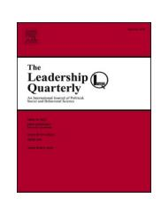
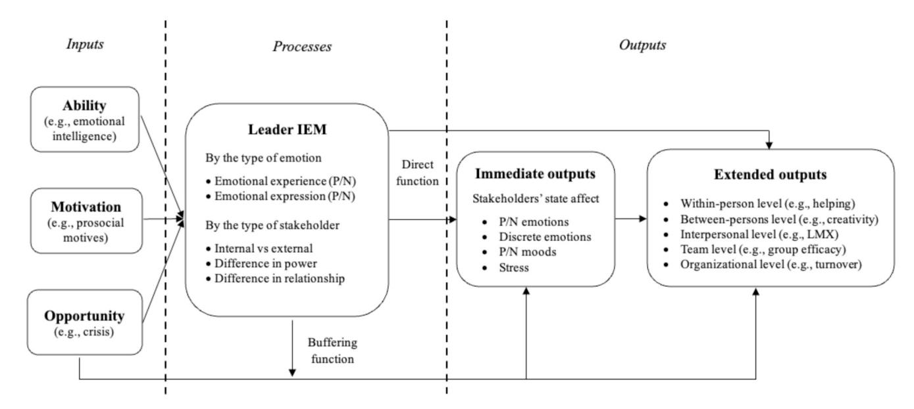
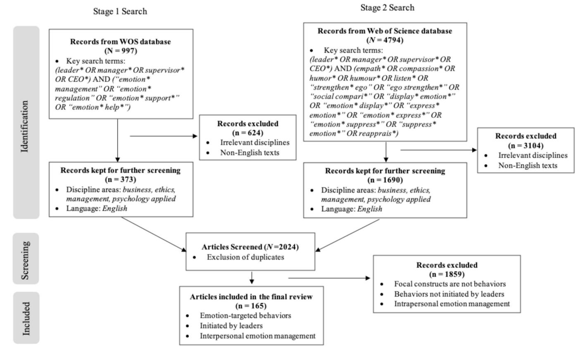
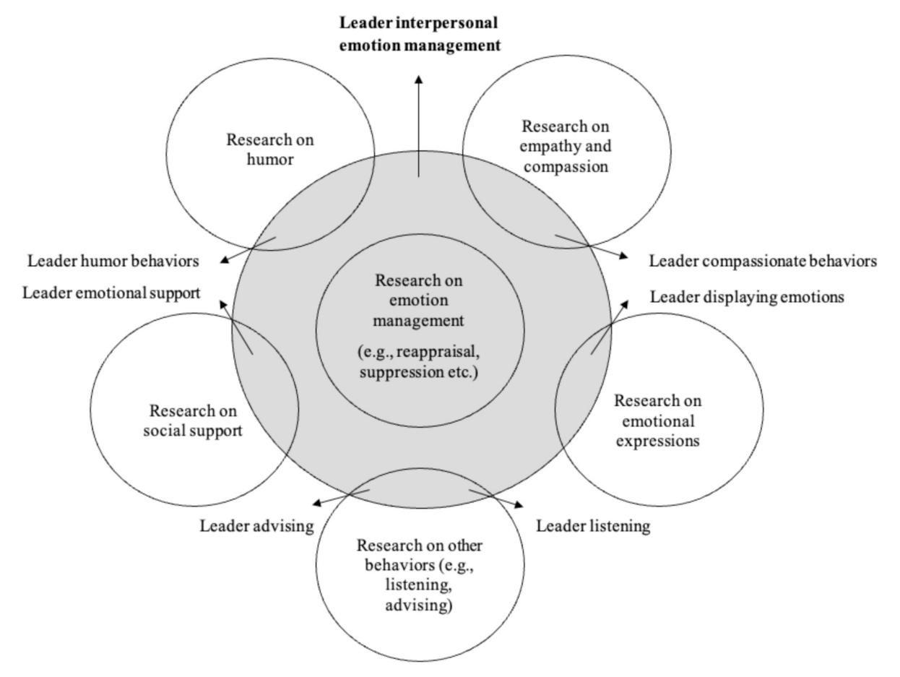

Contents lists available at [ScienceDirect](www.sciencedirect.com/science/journal/10489843)

# The Leadership Quarterly

journal homepage: [www.elsevier.com/locate/leaqua](https://www.elsevier.com/locate/leaqua)

# Leader interpersonal emotion Management: An Input-Process-Output framework and research agenda

Bo Shao

#### ARTICLE INFO

*Keywords:* Interpersonal emotion management Leadership Literature review

#### ABSTRACT

Leader interpersonal emotion management (IEM), such as leader humorous behaviors and the provision of emotional support, represents a distinct yet integrative leadership construct that highlights leaders' deliberate efforts to manage others' emotions. It extends beyond existing leader behavioral constructs by emphasizing the management of others' emotions as a fundamental behavioral mechanism underpinning effective leadership. Research on IEM has made notable progress over the past few decades; however, critical limitations remain that hinder further development of the literature. In this article, I clarify the conceptualization of leader IEM as *the behavioral processes through which leaders manage the emotions of relevant stakeholders* and integrate existing research findings into an input-process-output (IPO) framework. This framework comprises three key components: (a) inputs, which consist of ability, motivation, and opportunity factors; (b) processes, which capture broad strategies and specific tactics organized hierarchically; and (c) outputs, which include both immediate and extended outcomes at multiple levels. I further evaluate methodological rigor and propose directions for future research.

# **Introduction**

Employees experience a wide range of emotions in the workplace, which can have a significant impact on their well-being, as well as on the behaviors and performance of teams and organizations [\(Ashkanasy](#page-15-0) & [Dorris, 2017; Brief](#page-15-0) & Weiss, 2002). Consequently, an increasing number of scholars regard the management of employees' emotions as a key leadership function. For example, [Leavitt and Bahrami \(1988\)](#page-16-0) argued that managing employee emotions is as critical as managing other organizational functions such as marketing and finance. Similarly, [Pes](#page-16-0)[cosolido \(2002\)](#page-16-0) proposed that emergent group leaders serve as managers of group emotions. Importantly, research indicates that employees often view emotion help from their leaders as a managerial *in-role*  behavior [\(Toegel et al., 2013\)](#page-17-0) and expect their leaders to help manage their emotions.

Leader interpersonal emotion management (IEM) has been defined as "the processes and behaviors involved in assisting employees in regulating their emotional experiences so as to facilitate the attainment of organizational objectives" ([Kaplan et al., 2014, p. 566](#page-16-0)). While related to existing leadership constructs such as relational and inspirational leadership behaviors, leader IEM focuses specifically on leaders' deliberate efforts to manage others' emotions. By emphasizing emotionfocused regulatory functions, leader IEM provides a unifying yet distinctive behavioral lens that integrates affective processes into leadership theory and practice. Consequently, leader IEM extends existing leadership frameworks by foregrounding emotion management as a fundamental behavioral mechanism of leadership.

Despite rapid progress in this area, several important limitations exist and prevent the existing literature from further development. First, existing conceptualizations of leader IEM are problematic. Some definitions restrict the construct to the management of negative emotions, thereby excluding positive emotions (e.g., [Little et al., 2016\)](#page-16-0). Others focus only on emotional experiences while neglecting emotional expressions (e.g., [Kaplan et al., 2014](#page-16-0)). Still others center solely on followers as targets, overlooking the broader range of relevant stakeholders (e.g., [Little et al., 2016; Madrid et al., 2019\)](#page-16-0). Additionally, some definitions (e.g., [Kaplan et al., 2014\)](#page-16-0) conflate observable leader behaviors with underlying intentions or behavioral effects, creating conceptual ambiguity. Second, existing research predominantly views leader IEM as a set of behaviors, focusing on the effectiveness of these behaviors while overlooking several other critical aspects such as the enablers, drivers, and triggers of the emotion management behaviors and processes. Hence, a comprehensive literature review is critically needed to highlight these limitations and present opportunities for future research to

*E-mail address:* [jeff.shao@deakin.edu.au](mailto:jeff.shao@deakin.edu.au).

enrich the understanding of leader IEM.

In this article, I clarify the conceptualization of leader IEM and introduce an input-process-output (IPO) framework (see Fig. 1) as an integrative model for organizing existing research findings and setting a forward-looking research agenda. This IPO framework includes three critical components: (a) inputs, which consists of ability, motivation, and opportunity; (b) processes, which encompass broad strategies and specific tactics organized hierarchically; and (c) outputs, which include both immediate and extended outcomes across levels of analysis. These three components address distinct key research questions. For the *input*  component, the research question is: What personal and situational factors drive and shape leader IEM? For the *process* component, the research questions are: what are the key behaviors and processes involved in leader IEM, and how does leader IEM contribute to various outputs? For the *output* component, the research question is: what are the critical outcomes produced by leader IEM?

I make several contributions to the leader IEM literature. First, I expand the conceptualization of leader IEM by broadening its scope and extending its inclusivity. This refined definition helps to address inconsistencies in how the construct has been previously conceptualized within the current leader IEM literature. Second, I develop the first integrative IPO framework that comprehensively captures key elements around leader IEM. This framework is particularly valuable as it extends beyond the fragmented focus in existing literature. Finally, using this integrative framework, I offer a structured overview of the research progress to date, identify key limitations in the existing literature that require further investigation, and propose a research agenda to guide researchers to address identified limitations and advance understanding of leader IEM.

#### **Conceptualization**

Emotion management is often used interchangeably with related terms such as emotion regulation (e.g., [Thiel et al., 2012\)](#page-17-0), emotional support [\(Hammer et al., 2009\)](#page-15-0), or emotion help [\(Toegel et al., 2013\)](#page-17-0). To remain consistent with terminology commonly used in the management and leadership research (e.g., [Little et al., 2016; Kaplan et al., 2014;](#page-16-0)  [Shao, 2024](#page-16-0)), I adopt the term *emotion management*. In line with [Kaplan](#page-16-0)  [et al. \(2014\)](#page-16-0), I specifically use the term *interpersonal emotion management (IEM)* to refer to the management of others' emotions, excluding the

management of one's own emotions through social interactions.

Several definitions of leader IEM have been proposed in the literature (see [Table 1](#page-2-0)). These definitions typically conceptualize leader IEM as a set of behaviors. However, they suffer from several critical limitations. First, as noted by [Fischer and Sitkin \(2023\),](#page-15-0) leadership behaviors should not be conflated with their underlying intentions or behavioral effects, as these represent distinct concepts. However, some existing definitions of leader IEM blur this distinction by mixing behaviors with intentions or effects. For example, [Kaplan et al. \(2014\)](#page-16-0) define leader IEM as the processes and behaviors that are intended to "facilitate the attainment of organizational objectives" (p. 566), thereby embedding intentions into the definition of the behavior itself. Similarly, [Hammer et al. \(2009\)](#page-15-0) define supervisor emotionally supportive behaviors as "the extent to which supervisors make employees feel comfortable…" (p. 841). Yet, making employees feel comfortable is an effect of leader IEM behaviors, not the behavior itself, and should not be conflated.

Second, existing definitions of leader IEM are often inconsistent regarding the types and components of emotions involved. For example, [Little et al. \(2016\)](#page-16-0) limit leader IEM to "observable leader behaviors targeted at managing followers' negative emotions", thereby excluding positive emotions. However, leaders may engage in IEM to increase or decrease both negative and positive emotions (e.g., [Niven et al., 2019](#page-16-0)). Additionally, [Kaplan et al. \(2014\)](#page-16-0) restrict leader IEM to "the processes and behaviors involved in assisting employees in regulating their emotional experiences", overlooking the management of emotional expressions. Research, however, indicates that leaders also manage employees' emotional expressions by using the strategy of modulating emotional responses ([Little et al., 2016\)](#page-16-0).

Third, most existing definitions focus narrowly on followers as the primary targets of leader IEM (e.g., [Kaplan et al., 2014; Little et al.,](#page-16-0)  [2016; Madrid et al., 2019](#page-16-0)), neglecting the broader range of stakeholders whose emotions leaders must often attend to. This narrow focus fails to accurately reflect the full range of interpersonal responsibilities faced by leaders. Leaders frequently interact with various stakeholders beyond their followers [\(Yukl, 2008](#page-17-0)), and research suggests that leaders play a critical role in managing the emotions of these stakeholders, such as peers, clients, upper management, or the public (e.g., [Hatch, 1997;](#page-15-0)  Hobbs & [Allen, 2023; Huy](#page-15-0) & Zott, 2019). Focusing exclusively on followers thus hinders new theoretical development of leader IEM research and limits our understanding of leader IEM within broader interpersonal

**Fig. 1.** The Proposed Input-Process-Output (IPO) Model of Leader Interpersonal Emotion Management (IEM). Note. P/N represents positive and negative emotions; LMX represents leader-member exchange.

**Table 1**  Relevant Existing Concepts and Proposed Definitions of Leader Interpersonal Emotion Management.

| Concept                                                                 | Definition                                                                                                                                                                                                     | Type of stakeholder       | Type of emotion                                                                     | Unconflated behavior                                      |
|-------------------------------------------------------------------------|----------------------------------------------------------------------------------------------------------------------------------------------------------------------------------------------------------------|------------------------------|-------------------------------------------------------------------------------------|-----------------------------------------------------------|
| Leader emotion management                                               | "the processes and behaviors involved in assisting employees in regulating their emotional experiences so as to facilitate the attainment of organizational objectives" (Kaplan et al., 2014, p. 566) | Followers only               | Emotional experience only                                                           | No (behaviors conflated with underlying intentions) |
| Leader interpersonal emotion management                              | "observable leader behaviors targeted at managing followers' negative emotions" (Little et al., 2016, p. 86)                                                                                                | Followers only               | Negative emotions only                                                              | Yes                                                       |
| Leader interpersonal emotion regulation                              | "leaders' behaviours oriented to improve or worsen affective states among team members" (Madrid et al., 2019, p. 788)                                                                                       | Followers only               | Emotional experience only                                                           | Yes                                                       |
| Supervisor emotional support                                            | "the extent to which supervisors make employees feel comfortable …, express concern for …, and demonstrate respect, understanding, sympathy, and sensitivity …" (Hammer et al., 2009, p. 841)         | Followers only               | Emotional experience only                                                           | No (behaviors conflated with behavioral effects)       |
| Leader interpersonal emotion management (in the present research) | the behavioral processes through which leaders manage the emotions of relevant stakeholders                                                                                                                 | All relevant stakeholders | Both positive and negative emotions; both emotional experience and expression | Yes                                                       |

#### dynamics.

To address these limitations, I propose a more inclusive definition that avoids conflating behaviors with other elements such as intentions. I define leader IEM as *the behavioral processes through which leaders manage the emotions of relevant stakeholders*. This concise definition offers several strengths compared to existing ones. First, it captures leader behaviors aimed at managing both positive and negative emotions (including various discrete emotions) across various stakeholder groups with whom the leader interacts. Second, it encompasses not only the management of emotional experience, but also the management of emotional expressions, and as I discuss later, anticipated emotions that have yet to emerge in stakeholders. Third, by emphasizing leader IEM as behavioral processes rather than behaviors only, the definition reflects the dynamic, sequenced nature of leader IEM. Finally, it avoids conflating behaviors with behavioral intentions or effects by focusing solely on what leaders do, without presuming why they do it or what the outcomes will be.

Given the persistent issue of construct overlap and redundancy in the leadership literature ([Banks et al., 2018](#page-15-0)), it is crucial to clarify how leader IEM, as defined here, is conceptually distinct from existing leadership behavior constructs. [Banks et al. \(2018\)](#page-15-0) proposed an integrative theoretical framework that categorizes existing leader behaviors into five broad types: task-oriented (e.g., initiating structure), relational (e.g., consideration), passive (e.g., laissez-faire), inspirational (e.g., transformational leadership), and values-based/moral behaviors (e.g., authentic leadership). Leader IEM differs markedly from task-oriented behaviors because of their distinct focuses; it also contrasts with passive leadership behaviors, as leader IEM represents active, deliberate behaviors by leaders ([Niven, 2017](#page-16-0)).

That said, leader IEM shares conceptual linkages with relational, inspirational, and values-based/moral leadership behaviors. Specifically, because leader IEM focuses on managing the emotions of relevant stakeholders, it naturally aligns with relational behaviors, which emphasize interpersonal connection and support. Additionally, when leader IEM involves improving others' emotions—such as expressing appreciation or offering encouragement—it inspires others, thereby also aligning with inspirational leadership behaviors. Some values-based/ moral leader behaviors such as charismatic and ethical leadership are also conceptualized using emotion-related terms, suggesting a close connection with leader IEM. For example, [Antonakis et al. \(2016\)](#page-15-0) define charismatic leadership as "values-based, symbolic, and emotion-laden leader signaling" (p. 304), and [Banks et al. \(2021\)](#page-15-0) conceptualize ethical leadership as encompassing the "expression of moral emotions" (p. 6). These connections between leader IEM and existing leadership behaviors suggest that IEM represents a fundamental behavioral function of leadership, and this function may manifest in various ways across different leadership behaviors such as relational, inspirational, and

values-based/moral behaviors identified in [Banks et al. \(2018\).](#page-15-0)

Despite these conceptual connections and overlaps, I argue that leader IEM–as defined here and elaborated in the hierarchical framework presented in the following section–remains a distinct leadership behavior construct. As [Yukl and Gardner \(2019\)](#page-17-0) contend that behavior categories represent abstract attributes of the real world; even if multiple taxonomies describe overlapping aspects of leadership, the constructs themselves remain distinct when designed for different purposes, that is, to capture different conceptual domains. Leader IEM and its associated taxonomy are developed to highlight a specific focus on emotion management within interpersonal leadership dynamics—which is fundamentally different from the purpose of other leadership behavioral categories developed in [Banks et al. \(2018\)](#page-15-0).

More specifically, leader IEM is conceptually distinct from relational behaviors. While relational behaviors are typically intended to strengthen interpersonal connections, leader IEM is emotion-focused and may not necessarily contribute to relationship building. For example, modulating followers' emotional responses may be driven by organizational display rules, and has been found to negatively relate to leader-member exchange (LMX; [Little et al., 2016\)](#page-16-0). Leader IEM also differs from inspirational leadership behaviors. Unlike inspirational behaviors, which aim to motivate and uplift followers, leader IEM may instead function to discourage followers by downregulating their emotional states. For instance, [Madrid et al. \(2019\)](#page-16-0) found that leader affect-worsening regulation was positively associated with team negative affective tone and negatively associated with team innovation. Finally, leader IEM diverges from values-based/moral leadership behaviors in that it is value-neutral. That is, IEM does not inherently reflect ethical or prosocial intent. For example, [Vasquez et al. \(2021\)](#page-17-0) found that leaders may engage in IEM driven by either prosocial or egocentric motives—highlighting a key difference from values-based/moral leadership behaviors. Therefore, while some conceptual overlap is expected, the uniqueness and theoretical utility of leader IEM justify its treatment as a distinct construct within the leadership area.

# **Methods**

Because existing research either examines leader IEM as a broad construct or focuses on specific leader IEM behaviors, I employed a twostage procedure to conduct a comprehensive literature search (see [Fig. 2](#page-3-0) for details). In the first stage, following previous literature reviews (e.g., [Wu et al., 2021\)](#page-17-0), I searched the Social Science Citation Index (SSCI) collection within the Web of Science (WOS) database using two sets of key words in the topic fields. The first set targeted the leadership context: *leader\**, *manager\**, *supervisor\**, and *CEO\**. The second set focused on emotion-related terms: *emotion\* management*, *emotion\* regulation*, *emotion\* support\**, and *emotion\* help\**. This initial search

**Fig. 2.** The two-stage literature searches.

resulted in 997 articles. I then limited the results to publications in the disciplines of business, ethics, management, and psychology applied, and restricted the language to English. After applying these criteria, 373 articles remained for further assessment.

After screening this initial set of articles, I identified specific leader behaviors—such as the use of humor and empathic/compassionate behaviors—that align with the conceptualization of leader IEM [\(Kaplan](#page-16-0)  [et al., 2014; Toegel et al., 2013](#page-16-0)) but may have been missed during the initial search. Hence, in the second stage, I conducted an expanded search using additional keywords related to IEM, such as empathic\*, compassion\*, humor\*, humour\* (see Fig. 2 for the full list of key words), in combination with leadership-related key words (e.g., leader\*). This second search, applying the same inclusion criteria, yielded 1690 articles.

Together, these two-stage literature searches produced a combined pool of 2024 articles, after excluding duplicates. To ensure that only relevant articles on leader IEM was included, I manually reviewed the titles and abstracts, and—when necessary—the main texts (e.g., definitions and measurements). Articles were included only if they met the following three criteria: (a) they examined leader emotion-targeted *behaviors*, not traits or abilities; (b) they focused on emotion management conducted *by leaders*, rather than by other stakeholders; and (c) they addressed *interpersonal*, rather than intrapersonal, emotion management. Applying these criteria resulted in a final sample of 165 articles1 for the literature review.

It is important to note that not all leader behaviors captured through the keyword-based literature search were explicitly labeled as IEM. For example, while leader use of humor and empathic/compassionate behaviors are classified as IEM in some frameworks (e.g., [Kaplan et al.,](#page-16-0)  [2014; Toegel et al., 2013](#page-16-0)), other studies examine these behaviors

without explicitly referring to them as IEM (e.g., [Cooper et al., 2018;](#page-15-0)  [Kock et al., 2019](#page-15-0)). Nevertheless, these behaviors align with my definition of leader IEM, as the immediate function of these behaviors is to change others' emotions—regardless of any additional functions they may serve. For instance, humor is defined as "a social communication that is intended to be amusing" ([Cooper et al., 2018, p. 769](#page-15-0)), suggesting its immediate focus is emotional. Similarly, compassion often "centers upon a concern for ameliorating the suffering of another individual" ([Goetz et al., 2010, p. 352](#page-15-0)), implying it directly targets others' negative emotions. Accordingly, I included studies on such behaviors (e.g., humor, expressing empathy/compassion, emotion suppression/amplification, emotional support/help, and strengthening/hurting ego), even if the behaviors were not explicitly framed as IEM.

In contrast, other leader behaviors, such as emotional displays, cognitive reappraisal, distraction, direct action, listening, social comparisons, and providing advice, may not directly target others' emotions but can nonetheless function as IEM (Huy & [Zott, 2019; Kaplan et al.,](#page-16-0)  [2014; MacCann et al., 2025; Toegel et al., 2013](#page-16-0)). For example, leaders may express emotions spontaneously without specific goals, yet they may also display emotions strategically to influence stakeholders' emotions. Thus, these behaviors do not inherently constitute IEM; rather they qualify as IEM when leaders deliberately employ them to manage others' emotions. To remain conceptual clarity and consistency with my definition, I included only studies that explicitly labelled and theorized these behaviors as IEM. For instance, [Huy and Zott \(2019\)](#page-16-0) examined leader emotional displays and explicitly conceptualized them as managerial emotion regulation actions; their study was therefore included in this review. However, studies that investigated the interpersonal effects of leader emotional displays without explicitly framing them as IEM (e. g., Shao & [Guo, 2021; Van Kleef et al., 2009; Wang et al., 2018\)](#page-17-0) were excluded, as it is not possible to determine whether such displays were employed as IEM tactics.

The number of publications on leader IEM has accelerated

1 The list of the articles is available upon request.

substantially over the past few decades, with over half of the articles (54.5 %) published between 2020 and early 2025. Most articles (88.5 %) are empirical in nature, with quantitative articles comprising 69.1 %, followed by qualitative (17.6 %), and mixed methods articles (1.8 %). Conceptual and review articles account for 11.5 % of the total.

#### **An input-process-output model**

Following the guidance of [Elsbach and van Knippenberg \(2020\),](#page-15-0) who argue that "insights or perspectives offered arise from the review, rather than guide the review" (p. 1279), I did not impose a priori framework to direct the interpretation of the review. Instead, I began by coding key elements of studies—such as variables capturing leader IEM, antecedents, mediators, moderators, outcomes, contexts, research methods, measures–allowing patterns to emerge organically. As the coding process progressed, I iteratively engaged with relevant frameworks to seek insights that could shed light on the interpretation of the existing literature and provide inspiration for coding. Through this process, an overarching input-process-output (IPO) framework emerged as the most appropriate structure for synthesizing the literature and guiding the future research agenda. I subsequently used this IPO framework as a guide to expand my coding. Specifically, I categorized variables into three main domains: *input*, *process*, and *output*. Within each domain, I further constructed meaningful subcategories. For inputs, I coded for factors such as ability, motivation, and opportunity. For processes, I coded for the types (i.e., broad strategies or specific tactics) and the targets (i.e., followers, peers, clients, or the public) of leader IEM behaviors. For outputs, I coded for the types (i.e., immediate or extended) and levels of analysis (i.e., within-person, between-persons, interpersonal, team, or organizational).

Regarding the input domain, only a limited number of articles have examined personal factors, with 6.1 % focusing on ability and 3.6 % on motivation, and contextual factors—theorized as opportunities—were addressed in just 10.9 % of the articles. Regarding the process domain, as I elaborate in the following sections, I categorized leader IEM at the broad strategy level and the specific tactic level. At the strategy level, deploying attention emerged as the most frequently studies strategy (52.1 %), followed by providing emotional support (44.8 %), changing cognition (13.9 %), modifying situations (7.9 %), and modulating emotional response (4.8 %). At the tactic level, using humor was the most commonly examined tactic (47.3 %), followed by expressing empathy/compassion (30.9 %). All other tactics, collectively, were addressed in 47.2 % of the articles, with no single tactic receiving attention beyond 10 %. Finally, regarding the output domain, 75.2 % of the articles examined extended outputs, whereas only 15.2 % examined immediate outputs. Most articles (69.1 %) examined outputs at the between-persons level, followed by interpersonal (14.5 %), team (9.7 %), within-person (1.8 %), and organizational (1.2 %) levels. In the sections that follow, I elaborate on the IPO model, beginning with a discussion of the process component, followed by input and output components.

# *Process: Leader IEM*

The fundamental research questions addressed in the "process" component of the IPO model are: *what are the key behaviors and processes involved in leader IEM, and how does leader IEM produce critical outputs*? Much of the existing research on leader IEM draws from Gross'[s \(1998\)](#page-15-0) process model of emotion regulation. [Williams \(2007\)](#page-17-0) applied this model to the interpersonal emotion management context and proposed four interpersonal emotion management strategies: altering the situation, altering attention, altering the cognitive meaning of the situation, and modulating the emotional response. This four-strategy framework has since guided a significant body of research on leader IEM (e.g., [Little](#page-16-0)  et al., 2012, 2016; Mayr & [Teller, 2023; Yu et al., 2024](#page-16-0)).

While influential, this framework has some limitations. [MacCann](#page-16-0) 

[et al. \(2025\)](#page-16-0) argue that the four strategies are overly broad and fail to capture the range of specific leader behaviors or tactics employed within or across these strategies. Indeed, some researchers have adopted alternative approaches to explore more specific leader IEM behaviors—either by incorporating insights from outside the process model of emotion regulation (e.g., [Kaplan et al., 2014](#page-16-0)), or by investigating leader IEM inductively (e.g., [Toegel et al., 2013\)](#page-17-0). For example, [Kaplan et al.](#page-16-0)  [\(2014\)](#page-16-0) synthesized research findings from multiple literatures to identify eight categories of lead IEM behaviors: interacting and communicating in an interpersonally tactful manner, demonstrating consideration and support for employees, using emotional displays to influence employees' behaviors, structuring work tasks with consideration for employees' emotions, providing frequent emotional "uplifts", behaving in a fair and ethical manner, managing interactions and relationships among coworkers, and maintaining open and frequent communication. In contrast, [Toegel et al. \(2013\)](#page-17-0) employed an inductive approach to derive five categories of emotion-helping behaviors enacted by leaders: listening, validating (empathy and ego-strengthening), reframing, transforming, and advising.

To synthesize existing research, I coded leader IEM behaviors reported in the reviewed articles and compiled a comprehensive—though not exhaustive—list of these behaviors. My coding process was guided by several existing frameworks that provide distinct sets of IEM behaviors (e.g., [Little et al., 2012; Kaplan et al., 2014; MacCann et al.,](#page-16-0)  [2025; Toegel et al., 2013](#page-16-0)). I integrate these frameworks along with other relevant research that has examined specific leader IEM behaviors (e.g., Hammer et al., 2009; Huy & [Zott, 2019; Jian, 2022; Thiel et al., 2012](#page-15-0)), thereby constructing a more inclusive taxonomy.

#### *A hierarchical framework of leader IEM behaviors*

Critically, I note that these behaviors are not mutually exclusive; rather, they are conceptualized at different levels of abstraction. To better capture the distinctions and relationships among these leader IEM behaviors, I distinguish between broad *strategies* and specific *tactics*, and I organize these into a hierarchical framework in which tactics are mapped onto overarching strategies. The mapping process begins with the four broad strategies—modifying situations, changing cognition, deploying attention, and modulating emotional responses—that are well-established in the literature [\(Gross, 1998, 2015; Little et al., 2012](#page-15-0)). Each specific leader IEM tactic is assigned to one of these four strategies based on their definitions and patterns of usage in the existing literature. For instance, *providing advice* aligns with the broad strategy of *modifying situations* because the former helps others address problems in situations that trigger their emotions. Similarly, [Gross \(1998\)](#page-15-0) suggests that both *cognitive reappraisal* and *social comparisons* belong to cognitive change, and therefore, I mapped these two tactics onto the broad strategy of *changing cognition*.

However, several tactics—including listening, expressing empathy/ compassion, and strengthening/hurting ego (e.g., [Jian, 2022; Toegel](#page-16-0)  [et al., 2013](#page-16-0))—could not be readily mapped onto any of the four established strategies. Upon closer examination, these tactics appear to primarily serve others' social-emotional needs, such as "needs for appeasement, comforting, love, care, availability, proximity, and/or physical contact" (Rim´[e, 2006, p. 472\)](#page-16-0), This interpretation aligns with the concept of emotional support, as [Mathieu et al. \(2019\)](#page-16-0) argues that emotional support behaviors "can be in the form of listening to one's work concerns, allowing one to vent their emotions, and providing words of encouragement during difficult times" and "provide socioemotional resources, such as affection, sympathy, understanding, acceptance, and esteem from others" (p. 388). Therefore, I introduce a fifth broad strategy—*providing emotional support*—that encompasses these three leader IEM tactics that do not fit neatly within the original four-strategy framework. The hierarchical framework of leader IEM behaviors, including definitions and illustrative measurement items used in existing literature, is presented in [Table 2.](#page-5-0)

**Table 2**  Strategies and Tactics Employed in Leader Interpersonal Emotion Management.

| Leader IEM dimension                             | Problem- or emotion focused | Antecedent- or response focused | Affect improving or worsening | Definition                                                                                                                                                                                                                                       | Example items or description of behaviors                                                                                                                                        |
|--------------------------------------------------|-----------------------------------|---------------------------------------|-------------------------------------|--------------------------------------------------------------------------------------------------------------------------------------------------------------------------------------------------------------------------------------------------|-------------------------------------------------------------------------------------------------------------------------------------------------------------------------------------|
| Modifying situations                          | Problem focused                | Antecedent focused                 | Affect improving                 | Modifying or changing the situation by adding or removing emotion-provoking elements (Gross, 1998)                                                                                                                                         | "I modify the elements of the situation that are having an undesired impact on others" (Little et al., 2012).                                                                 |
| • Direct action                                  | Problem focused                | Antecedent focused                 | Affect improving                 | Directly modifying or changing the situation for the followers (MacCann et al., 2025)                                                                                                                                                         | "I try to fix things for them" (MacCann et al., 2025).                                                                                                                           |
| • Providing advice                               | Problem focused                | Antecedent focused                 | Affect improving                 | Providing advice to other people on how to solve the problems that have triggered their emotions (Toegel et al., 2013)                                                                                                                     | "I give someone helpful advice" (Niven et al., 2011).                                                                                                                            |
| Changing cognition                               | Problem focused                | Antecedent focused                 | Affect improving or worsening | Modifying how one thinks about a situation to alter its emotional impact (Gross, 1998, 2015)                                                                                                                                                  | "When I want others to feel more positive emotions (such as joy or amusement), I put their problems into perspective" ( Little et al., 2012).                              |
| • Cognitive Reappraisala                      | Problem focused                | Antecedent focused                 | Affect improving or worsening | Cognitively transforming the meaning or interpretation of the situation (Gross, 1998)                                                                                                                                                         | "I discuss different ways of interpreting the situation" (MacCann et al., 2025).                                                                                                 |
| • Making social comparisons                   | Problem focused                | Antecedent focused                 | Affect improving or worsening | Making downward or upward social comparison to influence others' emotions (MacCann et al., 2025)                                                                                                                                              | "I compare their situation to other people who are worse off" (MacCann et al., 2025)                                                                                             |
| • Displaying own emotionsb                    | Problem focused                | Antecedent focused                 | Affect improving or worsening | Managing one's own emotional displays to influence others' appraisal of the situations (Kaplan et al., 2014)                                                                                                                               | "Using emotional displays to influence employees' behavior" (Kaplan et al., 2014)                                                                                                |
| Deploying attention                           | Emotion focused                | Antecedent focused                 | Affect improving                 | Selecting which aspects of the situation to focus on by distracting attention away from the elements of a situation that are harmful to goals, concerns, or well-being, or by moving away from the situation entirely (Gross, 1998)  | "When a situation is disturbing others, I focus their attention away from the troubling aspect of the problem" (Little et al., 2012).                                      |
| • Distraction                                    | Emotion focused                | Antecedent focused                 | Affect improving                 | Distracting followers' attention from the situation to something else                                                                                                                                                                         | "I divert their attention to something else" ( MacCann et al., 2025).                                                                                                            |
| • Humor                                          | Emotion focused                | Antecedent focused                 | Affect improving                 | Changing negative emotions into positive emotions through the use of humor (MacCann et al., 2025; Toegel et al., 2013)                                                                                                                     | "I make jokes to make them smile" ( MacCann et al., 2025). "I made someone laugh" (Niven et al., 2011).                                                                    |
| Modulating emotional responses             | Emotion focused                | Response focused                   | Affect improving or worsening | Directly influencing physiological, experiential, behavioral or physiological components of the emotional responses to change the emotional state that is well developed (Gross, 1998), or elicit new emotions (Kaplan et al., 2014) | "I ask them to put a brave face on" ( MacCann et al., 2025).                                                                                                                     |
| • Suppressing/ amplifying others' emotions | Emotion focused                | Response-focused                      | Affect improving or worsening | Efforts to inhibit or amplify one's emotion-expressive behavior                                                                                                                                                                               | "When others are experiencing undesirable emotions, I tell them not to express them" ( Little et al., 2012).                                                                  |
| • Displaying own emotions                     | Emotion focused                | Response-focused                      | Affect improving or worsening | Managing one's own emotional displays to influence others' emotional responses (Kaplan et al., 2014)                                                                                                                                          | "Using emotional displays to influence employees' behavior" (Kaplan et al., 2014)                                                                                                |
| Providing emotional support                   | Emotion focused                | Response focused                   | Affect improving or worsening | Providing socioemotional resources, such as affection, sympathy, understanding, acceptance, and esteem from others (Mathieu et al., 2019)                                                                                                  | "My supervisor provides encouragement and emotional support" (Lin et al., 2022). "My supervisor takes the time to learn about my personal needs" (Hammer et al., 2009). |
| • Listening                                      | Emotion focused                | Response-focused                      | Affect improving                 | Providing a "listening ear" to those troubled by negative emotions or those who may want to share their positive emotions (MacCann et al., 2025; Toegel et al., 2013)                                                                   | "Listen to me when I'm frustrated about something and need to vent" (Lin et al. 2022). "Listen to them talk about their emotions" (                                        |
| • Expressing empathy/ compassion           | Emotion focused                | Response-focused                      | Affect improving                 | Demonstrating concern and empathy towards others' feelings and well-being, and accommodating others' needs                                                                                                                                 | MacCann et al., 2025). "Empathize with my concerns and feelings" (Lin et al. 2022). "Recognition of their loss" (Gilbert et al., 2021).                                 |
| • Strengthening/ hurting ego                  | Emotion focused                | Response-focused                      | Affect improving or worsening | Providing encouragement, appreciation and reassurance that strengths others' self-esteem ( MacCann et al., 2025; Toegel et al., 2013)                                                                                                      | "I let them know how much they mean to me" (MacCann et al., 2025). "I told someone about their shortcomings" ( Niven et al., 2011).                                        |

a Cognitive reappraisal should not be confused with the broader strategy of changing cognition. [Gross \(2015\)](#page-15-0) lamented on the confusion that 'the term "reappraisal" is now used so broadly that it is often coextensive with the entire family of cognitive change strategies' (p. 9). However, Gross emphasized that reappraisal is only "[o] ne particular well-studied form of cognitive change" [\(Gross, 2015, p. 9](#page-15-0)), and social comparison can be viewed as "[a]nother form of cognitive change ([Gross, 1998, p.](#page-15-0)  [284\)](#page-15-0). Additionally, [Thiel et al. \(2012\)](#page-17-0) also made a distinction between reappraisal and downward social comparison.

b Not all types of displaying own emotions belong to leader IEM. To qualify as an IEM tactic, leaders need to display their emotions to manage the emotions of relevant stakeholders. Those emotion displaying behaviors that are not targeted at stakeholders' emotions do not belong to leader IEM. Therefore, in this review, I only included those articles in which authors explicitly treat leaders' emotional displays as a leader IEM tactic in alignment with my definition. In addition, consistent with the emotions as social information model [\(Van Kleef, 2009\)](#page-17-0) that posits two mechanisms—a cognitive pathway and an affective pathway—through which leaders' emotional displays influence followers, I mapped displaying own emotions onto two strategies: changing cognition and modulating emotional responses.

It is important to acknowledge that while I attempt to present a hierarchical framework of distinct strategies and tactics, these categories are not always mutually exclusive. Some tactics may operate across multiple strategies. For example, the emotions as social information theory [\(Van Kleef, 2009\)](#page-17-0) posits that leaders' emotional displays influence followers via two pathways: a cognitive pathway, through which followers infer information from the emotional displays, and an affective pathway, whereby followers experience similar emotions through a contagion process. Therefore, a leader may display particular emotions to shape followers' interpretation of situations and, subsequently, to alter their emotional experience. For example, a leader may display positive emotions during times of crisis to reassure followers that circumstances are under control, thereby reducing fear and anxiety in followers [\(Humphrey et al., 2008\)](#page-16-0). Similarly, a leader may display certain emotions with the intention of directly transmitting them to followers (e.g., [Sy et al., 2018\)](#page-17-0). Accordingly, leaders' *displaying own emotions* are mapped onto two strategies: changing cognition and modulating emotional responses.

The hierarchical list of leader IEM behaviors also illuminates how leader IEM research intersects with, and differentiates itself from, adjacent research areas, as visualised in Fig. 3. As indicated by the large grey circle, leader IEM research is primarily built upon research on emotion management ([Gross, 1998; Williams, 2007](#page-15-0)). In addition, research areas on humor, empathy/compassion, emotional expressions, social support and other relevant topics have been pivotal in the development of leader IEM research (e.g., [Kaplan et al., 2014; Toegel](#page-16-0)  [et al., 2013\)](#page-16-0). However, it is important to note that humor and empathy/ compassion can be conceptualized either as personality traits or behaviors. Only when enacted as behaviors do they qualify as leader IEM. Similarly, while leaders' displaying of their own emotions is included as

leader IEM, not all types of displaying own emotions belong to leader IEM. To qualify as an IEM tactic, leaders need to display their emotions to manage the emotions of relevant stakeholders. Those emotion displaying behaviors that are not targeted at stakeholders' emotions fall outside the scope of leader IEM. Other behaviors—such as listening, advising, or making social comparisons—likewise qualify as leader IEM only when enacted by leaders to address stakeholders' emotions or emotionally charged situations.

#### *Other relevant typologies of IEM*

Several of the IEM behaviors listed in [Table 2](#page-5-0) have also been categorized into different typologies in prior literature. Below, I outline three common typologies that offer additional dimensions for interpreting leader IEM behaviors. In [Table 2](#page-5-0), I indicate the classification of each IEM strategy and tactic according to these typologies.

*Problem-* versus *emotion-focused IEM*. One frequently cited typology distinguishes between problem- and emotion-focused IEM strategies (e. g., [Little et al., 2016; Wang et al., 2023](#page-16-0)). This distinction originates from research on stress and coping where "[r]esearchers have distinguished between problem-focused coping, which aims to solve the problem, and emotion-focused coping, which aims to decrease negative emotion experience." [\(Gross, 1998, p. 274](#page-15-0)). In the context of leader IEM, problem-focused strategies aim to "mitigate or eliminate underlying causes of negative emotions" [\(Little et al., 2016, p. 86](#page-16-0)), and emotionfocused strategies attempt to decrease negative emotional experience but "leave the underlying cause of negative emotion unaddressed" ([Little et al., 2016, p. 86](#page-16-0)). Accordingly, [Little et al. \(2016\)](#page-16-0) suggest that modifying situations and changing cognition fall under problem-focused IEM strategy, whereas deploying attention and modulating emotional

**Fig. 3.** The intersections of leader interpersonal emotion management and other adjacent areas of research.

responses belong to emotion-focused IEM strategy.

*Antecedent-* versus *response-focused IEM*. The distinction between problem-focused versus emotion-focused strategies should not be confused with this second typology, introduced by [Gross \(1998\),](#page-15-0) which is antecedent- versus response-focused strategies. This latter distinction is grounded in the process model of emotion regulation. Specifically, antecedent-focused strategies aim to modify inputs to the emotional process such as situations or appraisals, whereas response-focused strategies seek to influence the emotional response after it has developed. In the context of leader IEM, antecedent-focused strategies include modifying situations, deploying attention, and changing cognition, whereas response-focused strategies include modulating emotional responses and providing emotional support.

*Affect-improving* versus *affect-worsening IEM*. A third typology, introduced by [Niven et al. \(2011\)](#page-16-0), distinguishes between affectimproving and affect-worsening strategies based on the regulatory motive, and this distinction has then been applied in leadership contexts (e.g., [Niven et al., 2019\)](#page-16-0). Affect-improving IEM is used to improve stakeholders' emotions whereas affect-worsening IEM is used to make stakeholders feel worse. Although most leader IEM research focuses on prosocial, affect-enhancing behaviors, this typology allows for a more balanced examination of the full spectrum of leader emotional influence.

# *Management of general versus discrete emotions*

Emotion research has traditionally classified emotions along some common dimensions such as valence or activation [\(Russell, 1980](#page-16-0)). However, there is increasing scholarly attention to discrete emotions in the broader emotion literature [\(Shao, 2024\)](#page-16-0). This shift reflects growing recognition that discrete emotions may require tailored management strategies or tactics due to their distinct triggers and drivers. Despite this emerging interest, the vast majority of studies included in this review (94.5 %) adopted a dimensional approach, focusing primarily on leaders' management of general negative emotions. Only around 5.5 % of the included research examined leader IEM in relation to discrete emotions, such as anger ([Metz et al., 2014; Thiel et al., 2012](#page-16-0)), pessimism ([Thiel et al., 2012\)](#page-17-0), bereavement/grief [\(Fisk, 2023; Gilbert et al., 2021](#page-15-0)), loneliness ([Yang et al., 2023\)](#page-17-0), and hopelessness ([Wang et al., 2023](#page-17-0)). These studies represent an important but still underdeveloped stream in leader IEM research.

# *Different stakeholders as targets of leader IEM*

As noted in the conceptualization of leader IEM, leaders are responsible for managing relationships with a diverse set of stakeholders—including followers, superiors, peers, shareholders, clients, and the public—each of whom can influence organizational successes. Accordingly, leaders' IEM efforts can be directed toward any of these stakeholder groups. However, existing research has predominantly concentrated on the management of followers' emotions, with 97.6 % of the articles in this review focused on this group. Encouragingly, a small number of articles have extended the scope of leader IEM to other stakeholder targets. For instance, in a qualitative study, [Huy and Zott](#page-16-0)  [\(2019\)](#page-16-0) demonstrated that managers' regulation of both internal employees' and external clients' emotions can help mobilize social capital by facilitating legitimacy judgements. Two articles capture leader IEM in relation to the public (Hobbs & [Allen, 2023; Lane et al., 2020\)](#page-15-0), and two others have explored how leaders use humor as IEM tactics in peer relationships ([Eisenhardt et al., 1997; Hatch, 1997\)](#page-15-0). I view the broadening of stakeholder focus as a promising direction for future research and I will discuss some potential opportunities in the future research agenda.

## *Operationalization of leader IEM*

This review identified two primary approaches to measuring leader IEM. The first one attempts to measure leader IEM as a list of mixed strategies or tactics (e.g., [Little et al., 2012; MacCann et al., 2025; Niven](#page-16-0)  [et al., 2011\)](#page-16-0), while the second focuses on individual leader IEM strategies or tactics such as providing emotional support (e.g., [Lin et al., 2022\)](#page-16-0) or using humor (e.g., [Cooper et al., 2018](#page-15-0)). [Table 3](#page-8-0) presents a summary of these measures. In a later section, I evaluate and report the rigor of IEM measures.

In addition to survey-based measurement, leader IEM has been manipulated in experimental studies (e.g., [Thiel et al., 2012; Thiel et al.,](#page-17-0)  [2015\)](#page-17-0), although such studies remain relatively scarce (approximately 7.3 % of the reviewed literature). For example, Thiel and colleagues ([Thiel et al., 2012](#page-17-0)) manipulated two leader IEM behaviors: reappraisal and downward social comparison in examining how these leader IEM behaviors may influence the relationships between followers' discrete emotions (i.e., anger and pessimism) and their cognitive task performance. In another study, [Thiel et al. \(2015\)](#page-17-0) manipulated leader IEM including reappraisal, suppression, and empathy to examine the effectiveness of these leader IEM behaviors in managing employees' stress. Some research also manipulated leader use of humor ([Ji et al., 2023;](#page-16-0)  [Rosing et al., 2022; Xu et al., 2025; Zampetakis](#page-16-0) & Gkorezis, 2023). These experimental studies are valuable because they provide evidence of causal relationships between leader IEM and its outcomes.

It is also important to note that leader IEM behaviors can be operationalized "at different levels such as event-specific, person-specific, and general style" [\(Little et al., 2016, p. 91\)](#page-16-0). Event- and person-specific operationalization link leader IEM behaviors to discrete emotiontriggering events (e.g., crisis or organizational change) or stakeholders' individual differences (e.g., affective states or personality). These approaches often highlight the contexts of leader IEM or enable investigation of within-person variability in leader IEM behaviors, recognizing that the same leader may engage in different IEM behaviors depending on the situation or target. Unfortunately, I did not identify any study that explicitly examines how leaders use different IEM behaviors to address distinct events or stakeholders. Instead, the majority of leader IEM research to date has adopted a "general style" approach (e. g., [Little et al., 2012,](#page-16-0) 2016). When operationalized as a general style, leader IEM reflects stable behavioral tendencies across time and contexts. This type of operationalization typically relies on between-persons designs, treating within-person variance as statistical noise.

#### *Different functions of leader IEM*

Based on the literature, I distinguish two primary functions through which leader IEM shapes outputs: direct and buffering functions (see [Fig. 1\)](#page-1-0).

*Direct function.* Leader IEM can exert a direct influence on stakeholders' affective states and other relevant outcomes. For example, [Vasquez et al. \(2020\)](#page-17-0) found that leader affect-improving regulation was positively related to follower positive affect, whereas leader affectworsening regulation was positively related to follower negative affect, demonstrating the direct consequences of IEM. Similarly, [Little](#page-16-0)  [et al. \(2012\)](#page-16-0) showed that leader IEM strategies including situation modification and cognitive change were positively associated with followers' trust in their supervisor, while modulating emotional responses was negatively associated with followers' trust. These findings collectively support the notion that leader IEM directly shapes stakeholder affect and associated outcomes.

*Buffering function.* Leader IEM can also function as a moderator, buffering the impacts of negative emotions or events on stakeholders' affective states or downstream outcomes. For instance, [Thiel et al.](#page-17-0)  [\(2012\)](#page-17-0) found that leader IEM moderated the relationship between followers' discrete emotions (i.e., anger vs. pessimism) and their task performance. Specifically, reappraisal was more effective than downward social comparison in mitigating the negative effects of incidental anger on followers' performance in identifying environmental opportunities and restrictions in a planning task, whereas the reverse was true for pessimism. In another study, [Griffith et al. \(2014\)](#page-15-0) demonstrated that

**Table 3**  Measures of Leader IEM Based on Existing Literature.

| Type of measures                                   | Measured variables                                                                                 | Dimensions and example items                                                                                                                                                                                                                                                                                                                                                                                                                                                                                                                                        |
|-------------------------------------------------------|----------------------------------------------------------------------------------------------------|------------------------------------------------------------------------------------------------------------------------------------------------------------------------------------------------------------------------------------------------------------------------------------------------------------------------------------------------------------------------------------------------------------------------------------------------------------------------------------------------------------------------------------------------------------------------|
| Measures of mixed IEM strategies/ tactics    | Interpersonal emotion management scale (Little et al., 2012)                                 | Situation modification: I modify the elements of the situation that are having an undesired impact on others. Attentional deployment: When a situation is disturbing others, I focus their attention away from the troubling aspect of the problem. Cognitive change: When I want others to feel more positive emotions (such as joy or amusement), I put their problems into perspective. Modifying the emotional response: When others are experiencing undesirable emotions, I tell them not to express them. |
|                                                       | Emotion regulation of others and self (EROS; Niven et al., 2011)                             | Extrinsic affect-improving: I spent time with someone. Extrinsic affect-worsening: I acted annoyed towards someone.                                                                                                                                                                                                                                                                                                                                                                                                                                        |
|                                                       | Regulating others' emotions scale (ROES; MacCann et al., 2025)                               | Expressive suppression: I ask them to put a brave face on. Downward social comparison: I compare their situation to other people who are worse off. Humor: I make jokes to make them smile. Distraction: I divert their attention to something else. Direct action: I try to fix things for them. Cognitive reframing: I discuss different ways of interpreting the situation. Valuing: I tell them they are very important to me. Receptive listening: I let them talk to me about their troubles.              |
| Measures of specific IEM strategies/ tactics | Leader use of humor (e.g., Avolio et al., 1999; Cooper et al., 2018; Martin et al., 2003) | General leader humor: My manager jokes around with me. Affiliative humor: My supervisor doesn't laugh or joke around with me. Aggressive humor: My supervisor often uses humor or teasing to put me down. Self-enhancing humor: If my supervisor is feeling depressed, he/she can usually cheer him-/herself up with humor. Self-defeating humor: My supervisor often goes overboard in putting him-/ herself down when he/she is making jokes or trying to be funny.                                         |
|                                                       | Empathic/compassionate leadership (e.g., Mayfield et al., 1998; Shuck et al., 2019)       | Empathic leadership: My supervisor gives me praise for my good work. Compassionate leadership: My supervisor takes the actions and do the things that will be helpful to others.                                                                                                                                                                                                                                                                                                                                                                     |
|                                                       |                                                                                                    |                                                                                                                                                                                                                                                                                                                                                                                                                                                                                                                                                                        |

Other measures such as supervisor emotional support

**Table 3** (*continued* )

| Type of measures | Measured variables                                   | Dimensions and example items                                                                                                                  |  |
|---------------------|------------------------------------------------------|--------------------------------------------------------------------------------------------------------------------------------------------------|--|
|                     | (e.g., Hammer et al., 2009; Methot et al., 2016), | emotional support. Family supportive supervisor emotional support: My supervisor takes the time to learn about my personal needs. |  |

leader IEM moderated the relationship between conflict type and group cohesion such that using distraction during relationship conflict resulted in better group cohesion compared to using cognitive reappraisal or no regulatory strategy.

Whether leader IEM functions directly or as a buffer, a central objective of most studies is to determine which leader IEM behaviors are linked to favorable or unfavorable outputs. I revisit this question when discussing the "output" component of the IPO model.

#### *Summary: Beyond behaviors*

Results from this literature review clearly demonstrate the rapid progress made in the leader IEM literature. However, one critical limitation is a lack of a nuanced understanding of the processes leading to the initiation and change of these behaviors. Building on Gross'[s \(2015\)](#page-15-0) extended process model of emotion regulation, I propose that leaders progress through three distinct stages when initiating IEM behaviors: (a) the identification stage, which concerns the decision of whether to manage emotions, (b) the selection stage, which entails deciding on which broad strategy to initiate for emotion management, and (c) the implementation stage, where a specific IEM tactic is enacted. I further propose an optional fourth stage—the alteration stage—that involves deciding on whether and how to adjust IEM strategies or tactics if the initial attempt proves unsuccessful. This identification-selectionimplementation-alteration process is critical for gaining a deeper understanding of the successes or failures of leader IEM. Unfortunately, despite the importance, this review did not uncover any research that provides insights into this process. I therefore call for future research to investigate the dynamic, multi-stage nature of leader IEM. Potential directions are outlined in the future research agenda.

# *Input: ability, motivation, and opportunity*

The key research question addressed in the "input" component of the IPO model is: What are the key factors that influence leader IEM? Drawing on the ability-motivation-opportunity (AMO) framework (e.g., [Fischer et al., 2017\)](#page-15-0), I categorized inputs into three groups: (a) ability (i. e., enabler), (b) motivation (i.e., driver), and (c) opportunity (i.e., trigger)*.* I selected the AMO framework because it is widely recognized in the management and leadership fields and has proven effective for integrating key predictors of behavior and performance (e.g., [Bos-](#page-15-0)[Nehles et al., 2023; Fischer et al., 2017\)](#page-15-0). Although the AMO framework guided my analysis, I remained open to incorporating additional categories to ensure a comprehensive representation of factors influencing leader IEM. Further, in alignment with the person-situation framework (Ross & [Nisbett, 2011\)](#page-16-0), I conceptualize abilities and motivations as 'person' factors, while opportunities which represent work contexts are classified as 'situation' factors (see [Table 4\)](#page-9-0). These two types of factors may influence leader IEM independently and interactively. In the sections that follow, I first elaborate on 'person' factors, followed by 'situation' factors.

## *Ability (i.e., enabler)*

To engage in IEM, leaders must possess the requisite abilities that enable them to recognize, understand, and manage emotions in others.

*General supervisor emotional support:* My supervisor provides encouragement and

**Table 4**  Different Factors that Belong to the Inputs of Leader IEM.

| Factor              |             | Example input                                                                                                                                                                                                                                                                                     |
|---------------------|-------------|---------------------------------------------------------------------------------------------------------------------------------------------------------------------------------------------------------------------------------------------------------------------------------------------------|
| Person factor    | Ability     | • Emotional awareness/intelligence (Humphrey et al., 2008; Kaplan et al., 2014; Kellner et al., 2019) • Leader mindfulness (Ni et al., 2023) • Leader power (Yoon, 2017) • Parental experience (Gartzia, 2024) • Positive affectivity, self-monitoring (Toegel et al., 2007) |
|                     | Motivation  | • Ethical factors: generosity, care, and responsibility (Jian, 2022) • Leader traditionality (Tan et al., 2021) • Prosocial versus egoist motives (Vasquez et al., 2021)                                                                                                              |
| Situation factor | Opportunity | General work context • Crisis (Alvinius et al., 2015; Kunst et al., 2023;                                                                                                                                                                                                                      |
|                     |             | Thiel et al., 2015; Wibowo & Paramita, 2022) • Conflicts (Griffith et al., 2014; Hammer et al., 2009; Turgeman-Lupo et al., 2020; Kelly et al., 2020)                                                                                                                                    |
|                     |             | • Difficult conversations (Bradley & Campbell, 2016; Hamstra et al., 2024; Young et al., 2017) • Newcomer adjustment (Gkorezis et al., 2016;                                                                                                                                                |
|                     |             | Kang et al., 2022) • Organizational change and strategy processes (Huy, 2002) • Virtual work (Imhanrenialena et al., 2023)                                                                                                                                                               |
|                     |             | Stakeholder emotions and other characteristics                                                                                                                                                                                                                                                    |
|                     |             | • Anger and pessimism (Thiel et al., 2012) • Anxiety, stress and exhaustion (Kranabetter & Niessen, 2016; Liu et al., 2022; Mayr & Teller, 2023)                                                                                                                                         |
|                     |             | • Bereavement and grief (Fisk, 2023; Gilbert et al., 2021; Peticca-Harris, 2019) • Hopelessness (Wang et al., 2023) • Loneliness (Yang et al., 2023)                                                                                                                                     |

For example, [Kellner et al. \(2019\)](#page-16-0) found that limited abilities in emotional awareness or emotional intelligence hindered frontline managers' emotional support to followers in high-trauma settings. Such abilities, which are conductive to leader IEM, could be enhanced through personal experiences or purposeful training. For instance, [Gartzia \(2024\)](#page-15-0) found that leaders' caring abilities could be developed through their parental experiences: leaders who spent more time parenting, thereby scoring high in supportive parenting, were more likely to exhibit emotionally supportive behaviors to their followers at work, thereby fostering positive workplace outcomes. In addition to acquired abilities, certain traits and individual differences are closely associated with a leader's capacity for IEM and are therefore included within this ability category. For example, [Toegel et al. \(2007\)](#page-17-0) found that leaders who scored high in self-monitoring tended to engage in emotion helping behaviors in the workplace.

### *Motivation (i.e., driver)*

Beyond ability, leaders must also be motivated to engage in IEM as motivation functions as the internal drive of IEM behaviors. Research has identified various underlying motives behind IEM ([Niven, 2016,](#page-16-0)  [Vasquez et al., 2021\)](#page-16-0). In particular, [Vasquez et al. \(2021\)](#page-17-0) found that leaders may have both egocentric and prosocial motives when they engage in IEM, and these motives can have distinct implications for outcomes such as LMX and leader effectiveness. Beyond the specific leader IEM motives, other studies point to broader motivational influences on leader IEM. For example, [Jian \(2022\)](#page-16-0) identified three ethical factors—generosity, care, and responsibility—that undergird and motivate empathic leadership. In another study, [Tan et al. \(2021\)](#page-17-0) found that traditionality—the extent to which a leader endorses traditional values such as deference to authority and hierarchical role relationships—served as a demotivator for leader humor behaviors.

## *Opportunity (i.e., trigger)*

Beyond 'person' factors, situational or contextual factors must also be present to prompt leader engagement in IEM. I refer to these contextual triggers as opportunities. However, only a small proportion of articles (n = 18, 10.9 %) explicitly included contextual factors as variables in their models. For example, [Griffith et al. \(2014\)](#page-15-0) examined different types of intragroup conflict as contextual factors and explored how leaders managed group members' emotions in response to each conflict type. Additionally, some articles did not model contextual factors explicitly but clarified contexts as their research backgrounds (n = 55, 33.3 %). For instance, [Kunst et al. \(2023\)](#page-16-0) examined leaders' management of healthcare workers' emotions; although contextual variables were not directly analyzed in their models, the study clearly framed the research within a highly salient emotional environment—"during a time of stress and uncertainty, that is, following the first outbreak of the COVID-19 pandemic" (p. 8). The remaining articles adopted a contextfree approach (n = 92, 55.8 %), treating leader IEM as a general behavioral tendency ([Little et al., 2016\)](#page-16-0).

For the articles that incorporated contexts—either as model variables or research backgrounds—I identified two broad categories of contextual triggers. The first concerns general work contexts, encompassing environmental or organizational conditions such as crisis ([Alvinius](#page-15-0)  [et al., 2015; Kunst et al., 2023; Thiel et al., 2015; Wibowo](#page-15-0) & Paramita, [2022\)](#page-15-0), work-life conflicts [\(Hammer et al., 2009; Turgeman-Lupo et al.,](#page-15-0)  [2020; Kelly et al., 2020\)](#page-15-0), relationship conflicts ([Griffith et al., 2014;](#page-15-0)  [Santarpia et al., 2024; Thiel et al., 2018\)](#page-15-0), organizational change and strategy processes [\(Huy, 2002\)](#page-16-0), among others.

The second category relates to stakeholder characteristics. One of the most immediate triggers for leader IEM is the presence of undesirable emotions in stakeholders. Emotions such as anxiety, stress and exhaustion ([Liu et al., 2022; Mayr](#page-16-0) & Teller, 2023), anger and pessimism ([Thiel](#page-17-0)  [et al., 2012\)](#page-17-0), loneliness ([Yang et al., 2023\)](#page-17-0), bereavement and grief ([Gilbert et al., 2021\)](#page-15-0), and team hopelessness [\(Wang et al., 2023](#page-17-0)), have all been examined as triggers for leader IEM behaviors. Beyond emotions, other stakeholder attributes—such as attitude, expectations, personality, or mindset—may influence whether leader engage in IEM. For example, [Toegel et al. \(2013\)](#page-17-0) found that employees perceived IEM as leaders' in-role responsibilities, suggesting that follower expectations may prompt leaders to engage in IEM.

In summary, results from this review suggest that limited research has dedicated to the investigation of "input" in the IPO model. I identified three primary input categories—ability, motivation, and opportunity. While existing research on these inputs offers valuable initial insights, it is critical to conduct more research to deepen our understanding of factors that drive or hinder leader IEM.

#### *Output: Immediate and extended outputs*

The key research question addressed in the "output" of the IPO model is: What are the key outputs produced by leader IEM? As outlined in [Table 5.](#page-10-0), I categorize these outputs into two groups: immediate and extended. Following [Ashkanasy and Dorris \(2017\),](#page-15-0) I further classify the outputs at different levels, including within-person, between-persons, interpersonal, team, and organizational levels.

### *Immediate outputs*

The immediate outputs of leader IEM center on changes in stakeholders' affective states—an indicator of IEM's proximal effectiveness. Conceptualizing leader IEM as a set of behavioral processes targeted at managing relevant stakeholders' emotions, the most direct outputs should naturally be the changes in stakeholders' affective states.

**Table 5**  Immediate and Extended outputs of leader IEM at different levels.

| Type of output | Level of output                                        | Example output                                                                                                                                                                                                                                                                                                                                                                                                                                                                                                                                                                             |
|-------------------|--------------------------------------------------------|--------------------------------------------------------------------------------------------------------------------------------------------------------------------------------------------------------------------------------------------------------------------------------------------------------------------------------------------------------------------------------------------------------------------------------------------------------------------------------------------------------------------------------------------------------------------------------------------|
| Immediate         | Within-person level Between-persons level     | • Positive/negative emotions (Chen et al., 2024) • Discrete emotions (e.g., anger, Griffith et al., 2014) • Positive/negative emotions (Cooper et al., 2018; Kunst et al., 2023; Xu et al., 2024) • Positive/negative moods (Humphrey et al., 2008) • Stress and emotional exhaustion (Thiel et al., 2015)                                                                                                                                                                                                                                                      |
|                   | Team level                                             | • Team positive/negative emotions (Huy, 2002; Kaplan et al., 2014; Madrid et al., 2019)                                                                                                                                                                                                                                                                                                                                                                                                                                                                                              |
| Extended          | Within-person level Between-persons level     | • Helping behaviors (Chen et al., 2024) • Work engagement (Wang et al., 2024) • Attachment and commitment (Tews et al., 2020) • Citizenship behaviors (Little et al., 2016) • Creativity (Yu et al., 2024) • Deviant behaviors (Kelly et al., 2020) • Job satisfaction (Little et al., 2016; Kock et al., 2019) • Perceived leader effectiveness (Thiel et al., 2012) • Performance (Niven et al. 2019; Thiel et al., 2012; Kock et al., 2019) • Turnover intention (Mayr & Teller, 2023; Wibowo & Paramita, 2022) • Voice (Lin et al., 2022) |
|                   | Interpersonal level Team level Organizational | • LMX (Little et al., 2016; Niven et al., 2019) • Trust in supervisor (Little et al., 2012) • Collective efficacy (Wang et al., 2023) • Group communication/cooperation (Thiel et al., 2018) • Group LMX (Vasquez et al., 2021) • Team citizenship behaviors (Madrid et al., 2018) • Team knowledge integration capacity and team creativity (Yang et al., 2024) • Team performance (Wang et al., 2023) • Resource mobilization for firms (Huy & Zott,                                                                                                    |
|                   | level                                                  | 2019) • Turnover and retention (Kaplan et al., 2014)                                                                                                                                                                                                                                                                                                                                                                                                                                                                                                                                    |

Because emotions are closely related to other types of affective states such as moods and stress, I take an inclusive approach and refer to the immediate outputs of leader IEM as stakeholders' state affect which includes a broad range of affective responses, including positive and negative emotions, discrete emotions, positive and negative moods, and stress.

Despite the theoretical salience of affective states as immediate outputs of leader IEM, empirical attention to this type of outputs remains limited; I only identified 25 articles (15.2 % of the reviewed literature) that explicitly examined such outputs (e.g., [Chen et al., 2024; Cooper](#page-15-0)  [et al., 2018; Kunst et al., 2023; Madrid et al., 2019; Xu et al., 2024\)](#page-15-0). For example, at the within-person level, [Chen et al. \(2024\)](#page-15-0) found that daily leader humor behaviors were positively associated with healthcare workers' daily positive affect, which in turn, was positively related to their next-day helping behaviors towards patients. At the betweenpersons level, [Kunst et al. \(2023\)](#page-16-0) studied how leader IEM behaviors (i. e., reappraisal and suppression) shaped followers' positive and negative affect, which subsequently influenced job satisfaction. At the team level, [Madrid et al. \(2019\)](#page-16-0) examined how leader IEM (i.e., affect-improving and affect-worsening regulation) influences team affective tone, which in turn influenced team innovation. Collectively, these findings suggest that stakeholder emotions are not only immediate outputs of leader IEM but also serve as conduit through which IEM exerts broader influence on critical work outcomes.

## *Extended outputs*

Beyond the direct influence on emotions, leader IEM has been found to influence a range of other outputs such as stakeholders' attitudes (e. g., satisfaction, commitment) and behaviors (e.g., creativity, performance), the quality of relationships between leaders and stakeholders, or other outputs at the within-person, between-persons, interpersonal, team, and organizational levels. I refer to these as extended outputs, to distinguish them from the immediate emotional consequences of leader IEM.

At the within-person level, studies have revealed short-term influences of leader IEM on both followers and leaders. For example, [Chen](#page-15-0)  [et al. \(2024\)](#page-15-0) found that daily leader humor behaviors were positively related to healthcare workers' next-day helping behaviors towards patients. In addition, [Wang et al. \(2024\)](#page-17-0) demonstrated that daily leader humor behaviors were positively associated with daily leader psychological capital, which in turn, was positively associated with daily leader work engagement, highlighting IEM outcomes for the leaders themselves. At the between-persons level, researchers have investigated a wide range of cognitive and behavioral outputs among followers. Cognitive outputs include attachment and commitment ([Tews et al.,](#page-17-0)  [2020\)](#page-17-0), job satisfaction ([Little et al., 2016; Kock et al., 2019\)](#page-16-0), perceived leader effectiveness ([Thiel et al., 2012\)](#page-17-0), and turnover intentions [\(Mayr](#page-16-0) & [Teller, 2023; Wibowo](#page-16-0) & Paramita, 2022). Behavioral outputs include citizenship behaviors ([Little et al., 2016\)](#page-16-0), creativity [\(Yu et al., 2024](#page-17-0)), deviant behaviors [\(Kelly et al., 2020](#page-16-0)), performance ([Niven et al. 2019;](#page-16-0)  [Thiel et al., 2012; Kock et al., 2019\)](#page-16-0), and voice ([Lin et al., 2022\)](#page-16-0). For example, [Kock et al. \(2019\)](#page-16-0) found that leader empathic behaviors—a form of leader IEM—were positively related to followers' job satisfaction and performance.

At the interpersonal level, research has focused on relational outputs including LMX [\(Little et al., 2016; Niven et al., 2019\)](#page-16-0) and trust [\(Little](#page-16-0)  [et al., 2012\)](#page-16-0). For example, [Little et al. \(2012](#page-16-0), 2016) found that leaders' use of situation modification and cognitive change increased LMX and followers' trust in their leaders. At the team level, extended outputs included collective efficacy ([Wang et al., 2023\)](#page-17-0), group communication ([Thiel et al., 2018\)](#page-17-0), group LMX [\(Vasquez et al., 2021](#page-17-0)), team knowledge integration capacity and team creativity ([Yang et al., 2024\)](#page-17-0), team citizenship behaviors ([Madrid et al., 2018](#page-16-0)), and team performance ([Wang](#page-17-0)  [et al., 2023\)](#page-17-0). For instance, [Thiel et al. \(2018\)](#page-17-0) found that leader IEM interacted with the type of relationship conflict to influence group communication and group identification. Finally, at the organizational level, research has identified outputs such as resource mobilization for firms (Huy & [Zott, 2019\)](#page-16-0) and turnover/retention [\(Kaplan et al., 2014](#page-16-0)). For instance, through an inductive field study, [Huy and Zott \(2019\)](#page-16-0) demonstrated how managers' emotion regulation of others, including employees and investors, help them mobilize social capital for their firms by facilitating legitimacy judgments.

## *Assessment of the outputs of leader IEM strategies and tactics*

Given that leader IEM encompasses a range of behaviors—including both broad strategies and specific tactics—a substantial body of research has examined which of these leader IEM behaviors are associated with desirable or undesirable outputs. In this section, I provide a descriptive overview of these findings, drawing on a synthesis of results from diverse empirical studies.

At the strategy level, the five key IEM strategies in the hierarchical framework have been examined across many studies. Overall, findings indicate that *modifying situations*, *changing cognition, and providing emotional support* are generally positively related to desirable outcomes such as follower positive affective states, cooperation, job satisfaction, LMX, organizational commitment, task performance, trust in supervisors, and voice ([Gartzia, 2024; Kunst et al., 2023; Little et al., 2012,](#page-15-0)  [2016; Mathieu et al., 2019; Thiel et al., 2018\)](#page-15-0). However, *modulating emotional responses* is often linked to undesirable outcomes such as negative affective states, low trust in supervisors and low LMX, whereas

the *deploying attention* appears unrelated to desirable outcomes (e.g., [Kunst et al., 2023; Little et al., 2012,](#page-16-0) 2016). Some scholars have further combined modifying situations and changing cognition under a *problemfocused IEM* strategy, and deploying attention and modulating emotional responses under an *emotion-focused IEM* strategy. Research findings generally support that problem-focused strategy is more likely associated with desirable outputs whereas emotion-focused IEM strategy is more likely related to undesirable outputs (e.g., [Wang et al., 2023; Yang](#page-17-0)  [et al., 2023; Yu et al., 2024\)](#page-17-0).

It should be noted that although research has examined IEM at the strategy level, the measures used in some studies often only capture certain types of tactics, rather than a representation of diverse tactics. For example, the widely cited scales of IEM strategies by [Little et al.](#page-16-0)  [\(2012\)](#page-16-0) operationalize modifying situations through direct actions (excluding providing advice), deploying attention through distraction (excluding humor), changing cognition through reappraisal (excluding making social comparisons and displaying own emotions), and modulating emotional responses through suppression. Hence, findings regarding the outputs of these strategies may be driven more by specific tactics rather than by the broader strategies.

Beyond broad strategies, a growing number of studies focus on specific leader IEM tactics such as leader empathic/compassionate behaviors and use of humor. Findings suggest that expressing empathy/ compassion is often associated with desirable outputs for employees, including better stakeholder emotions and psychological wellbeing ([Shuck et al., 2019; Young et al., 2017\)](#page-17-0), higher engagement [\(Shuck](#page-17-0)  [et al., 2019](#page-17-0)), greater job performance and job satisfaction ([Kock et al.,](#page-16-0)  [2019\)](#page-16-0), stronger resilience (Wibowo & [Paramita, 2022](#page-17-0)), lower physical isolation in virtual work environments [\(Imhanrenialena et al., 2023](#page-16-0)), lower turnover intention [\(Imhanrenialena et al., 2023; Shuck et al.,](#page-16-0)  [2019\)](#page-16-0), better self-regulation (Wibowo & [Paramita, 2022\)](#page-17-0), and greater trust [\(Imhanrenialena et al., 2023](#page-16-0)).

Leader use of humor is another frequently examined IEM tactic. Overall, research shows that leader humor is related to follower positive emotions ([Cooper et al., 2018; Yang et al., 2017](#page-15-0)), and other desirable work outcomes including stronger LMX or leader-member guanxi ([Cooper et al., 2018; Yang](#page-15-0) & Zhang, 2022), higher employee relational energy [\(Zhang et al., 2023\)](#page-17-0), greater employee inclusion ([Tremblay,](#page-17-0)  [2017\)](#page-17-0), more employee OCBs ([Cooper et al., 2018; Tremblay, 2017; Yang](#page-15-0)  & [Zhang, 2022](#page-15-0)), higher employee work engagement ([Wang et al., 2024](#page-17-0)), and more employee and team creativity (Shih & [Nguyen, 2022; Yang](#page-17-0)  [et al., 2024\)](#page-17-0). However, some research suggests that how leader humor is associated with desirable outputs depends on its form. Leader affiliative and self-enhancing humor are generally associated with positive outcomes such as follower positive emotions and more knowledge sharing ([Xu et al., 2024](#page-17-0)), and higher trust in leaders (Neves & [Karagonlar, 2020](#page-16-0)), whereas aggressive and self-defeating humor are generally linked to negative outcomes, such as follower negative emotions and less knowledge sharing ([Xu et al., 2024](#page-17-0)), and lower trust in leaders ([Neves](#page-16-0) & [Karagonlar, 2020](#page-16-0)).

Finally, a small body of research examines the outputs of *affectimproving* and *affect-worsening IEM behaviors,* which encompasses a variety of IEM tactics such as providing advice, humor, displaying own emotions, listening, and strengthening/hurting ego. Findings indicate that leader affect-improving IEM is related to positive emotions and other desirable outputs such as more team innovation, whereas affectworsening IEM is associated with negative emotions and other undesirable outputs such as low team innovation (e.g., [Madrid et al., 2018,](#page-16-0)  [2019; Niven et al., 2019; Vasquez et al., 2020\)](#page-16-0).

In summary, research on leader IEM has made meaningful progress, identifying that several leader IEM strategies and tactics are linked to desirable outcomes. Despite the progress, a critical issue remains regarding the robustness and credibility of these findings, particular in light of the increasing concerns about methodological rigor in leadership research [\(Antonakis et al., 2010; Fischer](#page-15-0) & Sitkin, 2023). In the following section, I provide a critical evaluation of the methodological

rigor in the leader IEM literature.

#### **A critical evaluation of methodological rigor**

In this section, I focus on two aspects of methodological rigor—measurement and statistical analysis—in alignment with the recent discussion over problematic research methodologies in existing leadership literature [\(Antonakis et al., 2010; Fischer, 2023; Fischer](#page-15-0) & Sitkin, [2023\)](#page-15-0).

## *Rigor in measurement*

Scholars have increasingly critiqued the measurement of leadership behaviors in existing literature, particularly highlighting the conflation of behaviors with other constructs such as behavioral intentions or effects (e.g., Fischer & [Sitkin, 2023; Van Knippenberg](#page-15-0) & Sitkin, 2013). As emphasized by [Fischer \(2023\),](#page-15-0) a rigorous measure of leader behavior should be behaviorally counterfactual—that is, it "exclusively refers to the presence (i.e., displayed or not), magnitude (e.g., frequency or intensity) or temporal unfolding (e.g., rate, duration, temporal patterning) of a behavior" (p. 5).

Measures that do not meet this standard may suffer from three problems: (a) double-barreled items, which mix the description of a leadership behavior with another construct such as intention, (b) interpretive items, which require interpretation whether or not a concrete behavior can be seen as an instance of it, and (c) non-behavioral items, which fail to capture leadership behaviors [\(Fischer, 2023\)](#page-15-0). To evaluate whether measures of leader IEM in existing literature suffers from these issues, I conducted a review of the 100 articles that explicitly specified the leader IEM measures used. Guided by [Fischer \(2023\)](#page-15-0), I assessed whether each measure included items that were behaviorally counterfactual or suffer from one or more of the three issues. The analysis revealed that only 29 articles employed methodologically rigorous, behaviorally counterfactual measures of leader IEM. The remaining articles used measures that included one or more problematic item types, compromising construct validity.

[Table 6](#page-12-0) illustrates examples of some of the most frequently used leader IEM measures that I identified and evaluated. For example, one item designed to capture the tactic of providing advice within the affectimproving strategy ([Niven et al., 2011](#page-16-0)) states: "Gives team members helpful advice" [\(Madrid et al., 2019, p. 805\)](#page-16-0). This is an interpretive item as it requires respondents to make a subjective judgment about whether the advice was "helpful". To address the issue, I suggest removing the word "helpful" from the item. Another illustrative item, drawn from [Avolio et al.](#page-15-0)'s (1999) measure of leader humor, reads: "Uses a funny story to turn an argument in his or her favor" (p. 221). This is a doublebarreled item as it conflates a behavior (telling a funny story) with an intention (winning an argument). I recommend rewording it to "tells funny stories" to address the issue. The limited use of behaviorally counterfactual items highlights an urgent need for more precise and valid measurement in the development of leader IEM instruments.

# *Rigor in statistical analyses*

A critical challenge in drawing causal inferences from statistical analyses in leadership research is the issue of endogeneity [\(Antonakis](#page-15-0)  [et al., 2010\)](#page-15-0). Endogeneity occurs when statistical estimates are biased due to omitted variables, omitted selections, simultaneity, commonmethod variance, or measurement errors ([Antonakis et al., 2010](#page-15-0)). Leadership behaviors—including leader IEM behaviors—are particularly prone to endogeneity, as they are often influenced by various factors, such as contexts and follower behaviors. Addressing endogeneity is thus essential for ensuring the robustness of statistical analyses in the leader IEM literature. Following established guides and recommendations (e.g., [Bastardoz et al., 2023](#page-15-0)), I assessed the extent to which endogeneity issues are addressed in leader IEM research.

**Table 6**  Evaluation of representative measures frequently used in leader interpersonal emotion management literature.

| Leader IEM construct                                                                                                | Original measure          | Example citing article                                                                                                                                         | Rigor | Example item                                                                                                                                                               | Suggested wording                                                                                                               |
|------------------------------------------------------------------------------------------------------------------------|------------------------------|----------------------------------------------------------------------------------------------------------------------------------------------------------------|-------|----------------------------------------------------------------------------------------------------------------------------------------------------------------------------|------------------------------------------------------------------------------------------------------------------------------------|
| Modifying situations; changing cognitions; deploying attention; modulating emotional responses | Little et al. (2012)   | Little et al. (2016); Mayr & Teller (2023); Santarpia et al. (2024); Thiel et al. (2018); Wang (Andrew) et al. (2023); Yang et al. (2023); Yu et al. (2024) | N     | When my supervisor wants me to feel less negative emotions (such as anger or sadness), s/he puts my problems into perspective. (double barreled item) | When I feel negative emotions (such as anger or sadness), my supervisor puts my problems into perspective. |
| Affect improving and affective worsening strategies                                                        | Niven et al. (2011)    | Madrid et al. (2018, 2019), Vasquez et al. (2020, 2021)                                                                                                        | N     | Gives team members helpful advice. (interpretive item)                                                                                                               | Gives team members advice.                                                                                                   |
| Providing emotional support                                                                                      | Hammer et al. (2009)   | Kelly et al. (2020), Turgeman-Lupo et al. (2020)                                                                                                               | N     | My supervisor is willing to listen to my problem in juggling work and nonwork life. (non-behavioral item)                                                   | My supervisor listens to my problem in juggling work and nonwork life.                                              |
| Using humor                                                                                                            | Martin et al. (2003)   | Carnevale et al. (2022), Kim et al. (2016), Tremblay and Gibson (2016), Xu et al. (2024)                                                                       | N     | My supervisor enjoys making people laugh. (non-behavioral item)                                                                                                      | My supervisor tells jokes to people.                                                                                         |
|                                                                                                                        | Cooper et al. (2018)   | Li et al. (2023), Siddiquei et al. (2024), Yang & Zhang (2022)                                                                                                 | Y     | My supervisor jokes around with me. (behaviorally counterfactual item)                                                                                            |                                                                                                                                    |
|                                                                                                                        | Avolio et al. (1999)   | Gkorezis et al. (2014), Pundt and Venz (2017), Yuan et al. (2023)                                                                                              | N     | Uses a funny story to turn an argument in his or her favor. (double-barreled item)                                                                                | Tells funny stories.                                                                                                            |
| Expressing empathy/ compassion                                                                                   | Mayfield et al. (1998) | Men et al. (2024); Syed et al. (2022); Tao et al. (2022)                                                                                                       | Y     | Shows me encouragement for my work efforts. (behaviorally counterfactual item)                                                                                 |                                                                                                                                    |

Specifically, I reviewed the 117 articles that employed quantitative and mixed-method designs. Of these articles, six involved analyses (e.g., cluster analysis or exploratory factor analysis) irrelevant to endogeneity. Therefore, my evaluation focused on the remaining 111 articles. For analyses to be free from endogeneity, independent variables must be exogenous—that is, they should be variables manipulated in an experimental design or trait variables ([Bastardoz et al., 2023; Shao, 2024](#page-15-0)). I found that only 8 articles2 (7.2 %) avoided endogeneity issues. For example, Thiel and colleagues ([Thiel et al., 2012](#page-17-0); 2015) experimentally manipulated leader IEM tactics—including reappraisal, downward social comparison, suppression, and empathy—to examine their relative effectiveness. Their findings suggest that the effectiveness of leader IEM depends on the specific emotions being managed (e.g., anger, pessimism, stress) and the context (e.g., a crisis). The remaining 103 articles (92.8 %) all suffered endogeneity problems. These findings are consistent with Shao'[s \(2024\)](#page-16-0) broader review of leader affect research, which reported that only 9.4 % of the empirical articles were without endogeneity issues.

#### *Summary*

Results from this review clearly indicate a lack of rigor in existing leader IEM research, reflected in measurement and statistical analysis. Given these limitations, it is problematic to draw firm conclusions about the causal effects of leader IEM based on the current empirical literature. This presents a significant threat to the credibility of the existing research findings. Accordingly, I recommend that these findings be interpreted with caution. To advance the field, future research should follow Fischer'[s \(2023\)](#page-15-0) guidelines to revise and refine existing leader IEM measures, ensuring they accurately capture leader behaviors through behaviorally counterfactual items. In addition, future research should address endogeneity concerns in statistical analyses to support valid causal inferences. Researcher should consider adopting strategies appropriate for non-experimental designs, such as propensity score analysis and difference-in-differences models ([Antonakis et al., 2010\)](#page-15-0), to enhance internal validity when experimental manipulation is not feasible.

Beyond issues with the measurement and statistical analyses, this review also reveals the dominance of cross-sectional survey methods in current leader IEM research. While such designs offer valuable insights, they are inherently limited in their ability to establish causality. Therefore, I strongly encourage the use of rigorous experimental and intervention-based designs to more directly test the causal impacts of leader IEM on relevant outcomes. Finally, I advocate for the broader adoption of longitudinal research designs, which can help enhance the credibility of causal relationship ([Fitzmaurice et al., 2012\)](#page-15-0). Longitudinal approaches are particularly valuable given that leader IEM is typically conceptualized and operationalized as a stable behavioral pattern, often overlooking within-person variability. Investigating temporal

2 Seven of these eight articles experimentally manipulated their independent variables including leader IEM [\(Griffith et al. 2014;](#page-15-0) [Hoption et al., 2013; Moake](#page-16-0)  & [Robert, 2022](#page-16-0); [Niven et al., 2019](#page-16-0); [Thiel et al., 2012](#page-17-0), 2015; [Zampetakis](#page-17-0) & [Gkorezis, 2023](#page-17-0)). One study [\(Toegel et al., 2007](#page-17-0)) examined traits (i.e., positive affectivity and self-monitoring) as independent variables and measured the dependent variable of leader IEM as "a count of how many others in the organization nominated the focal individual as someone to whom they turned to for emotional help" (p. 349). Thus, none of them involves conflated leader IEM measures.

fluctuations in leader IEM behaviors can offer a more nuanced and dynamic understanding of how leaders manage stakeholder emotions across situations and time.

#### **An agenda for future research**

Table 7 presents fundamental research questions across the input, process, and output components of the framework, along with proposed future research directions to help address these questions. Below, I elaborate on these future research directions.

#### *Process: Leader IEM*

The process domain seeks to address two core questions: What behaviors and processes are involved in leader IEM, and how do these behaviors and processes function to produce outputs? Despite research progress in identifying leader IEM behaviors, I suggest three future research directions to further advance understanding of the process component.

*Direction one: Uncover the identification-selectionimplementation-alteration process.* Existing literature has identified various general strategies and specific tactics used in leader IEM. However, a key limitation is the oversight of the unfolding processes—from the decision to initiate IEM, through the selection of strategies and tactics, to the alteration of behaviors when initial attempts are unsuccessful. I propose that future research should provide valuable insights into the unfolding of this process. Key research questions that should be addressed in future research include: (a) how do leaders identify stakeholders' needs for IEM? (b) how do leaders select a particular IEM strategy and tactic for implementation? (c) how do leaders adapt or switch between different IEM strategies or tactics in response to feedback or failure?

*Direction two: Incorporate proactive leader IEM and its preventative function*. Existing typologies classify leader IEM behaviors along dimensions such as focus (e.g., problem- versus emotion-focused; antecedent- vs. response-focused) and direction (e.g., affect-improving versus affect-worsening). Yet, the temporal dimension—when IEM is enacted—remains underexplored. Most studies examine leader IEM in response to stakeholders' emotions have already emerged (which I refer to as leader reactive IEM), but little research has explored what leaders could do to manage anticipated emotions before they arise (which I refer to as proactive leader IEM). Addressing this omission is critical as proactive leader IEM may help prevent undesirable emotions, thereby safeguarding stakeholders' wellbeing and performance. Leaders likely differ in their capacity for affective forecasting (Wilson & [Gilbert, 2003](#page-17-0)), which in turn may shape their engagement in proactive IEM. Future research could address the following questions: (a) How does leader proactive IEM differ from reactive IEM? (b) What strategies and tactics are more effective in proactive IEM? (c) What are the unique inputs and outputs of leader proactive IEM?

*Direction three: Expand focus beyond followers to include other stakeholders*. As revealed in the literature review, most research on leader IEM focuses exclusively on followers. However, leaders interact with a broader set of internal and external stakeholders, including peers, superiors, clients, investors, and the public. These stakeholders differ from followers and warrant greater attention in future research. For example, managing the emotions of superiors—who hold more power-—may differ from managing those of followers. In such cases, leader IEM may serve more instrumental purposes, such as impression management or securing valuable resources. Similarly, managing the emotions of clients can be complex, given their varying needs and relational dynamics with both the leader and the organization. Leaders may prioritize situation modification for clients in transactional relationships, while complementing this with emotional support strategies for clients in longterm, relationally close partnerships. Therefore, I encourage future research to broaden its scope to include a wider range of stakeholder

**Table 7**  Key research questions and future research directions based on the input-

| Model element              | Input                                 | Process                                 | Output                                                                                                                                                                                        |
|----------------------------|---------------------------------------|-----------------------------------------|-----------------------------------------------------------------------------------------------------------------------------------------------------------------------------------------------|
| Broad and                  | What are the key                      | What are the key                        | What are the key                                                                                                                                                                              |
| fundamental                | 'person' (e.g.,                       | behaviors and                           | outputs produced                                                                                                                                                                              |
| research                   | ability and                           | processes involved                      | by leader IEM?                                                                                                                                                                                |
| questions to address in | motivation) and 'situation' (e.g., | in leader IEM, and how does leader   |                                                                                                                                                                                               |
| the IPO                    | context/                              | IEM produce                             |                                                                                                                                                                                               |
| model                      | opportunity)                          | important outputs                       |                                                                                                                                                                                               |
|                            | factors that drive                    | (i.e., boundary                         |                                                                                                                                                                                               |
|                            | leader IEM?                           | conditions and mechanisms)?          |                                                                                                                                                                                               |
| Future                     | Future direction                      | Future direction                        | Future direction                                                                                                                                                                              |
| research                   | one: Identify                         | one: Uncover the                        | one: Study                                                                                                                                                                                    |
| directions to              | additional                            | identification                          | immediate outputs                                                                                                                                                                             |
| explore and                | 'person' factors                      | selection                               | more                                                                                                                                                                                          |
| specific                   | influencing                           | implementation                          | comprehensively.                                                                                                                                                                              |
| sample                     | leader IEM.                           | alteration process.                     |                                                                                                                                                                                               |
| questions to               |                                       |                                         | Sample questions:                                                                                                                                                                             |
| address                    |                                       | Sample questions:                       | (a) What are the                                                                                                                                                                              |
|                            | Sample                                | (a) How do leaders                      | critical immediate                                                                                                                                                                            |
|                            | questions: (a)                        | identify                                | outputs (e.g.,                                                                                                                                                                                |
|                            | What are the other relevant        | stakeholders' needs for IEM? (b) How | discrete emotions such as loneliness)                                                                                                                                                      |
|                            | abilities (e.g.,                      | do leaders select a                     | that have been                                                                                                                                                                                |
|                            | cultural                              | particular IEM                          | missed in the                                                                                                                                                                                 |
|                            | sensitivity) that                     | strategy and/or                         | existing literature?                                                                                                                                                                          |
|                            | may drive leader                      | tactic for                              | (b) How do leaders                                                                                                                                                                            |
|                            | IEM? (b) What                         | implementation?                         | manage the trade                                                                                                                                                                              |
|                            | are the other                         | (c) How do leaders                      | offs between short                                                                                                                                                                            |
|                            | relevant                              | adapt or switch                         | and long-term                                                                                                                                                                                 |
|                            | motivational                          | between different                       | outputs of IEM?                                                                                                                                                                               |
|                            | factors (e.g.,                        | IEM strategies or                       |                                                                                                                                                                                               |
|                            | needs for                             | tactics in response                     |                                                                                                                                                                                               |
|                            | autonomy,                             | to feedback or                          |                                                                                                                                                                                               |
|                            | competency, and                       | failure?                                |                                                                                                                                                                                               |
|                            | relatedness) that                     |                                         |                                                                                                                                                                                               |
|                            | may drive leader                      |                                         |                                                                                                                                                                                               |
|                            | IEM? Future direction              | Future direction                        | Future direction                                                                                                                                                                              |
|                            | two: Examine                          | two: Incorporate                        | two: Expand focus                                                                                                                                                                             |
|                            | person-situation                      | proactive leader                        | to within-person,                                                                                                                                                                             |
|                            | interactions.                         | IEM and its                             | team and                                                                                                                                                                                      |
|                            |                                       | preventative                            | organizational                                                                                                                                                                                |
|                            |                                       | function.                               | outputs.                                                                                                                                                                                      |
|                            | Sample                                |                                         |                                                                                                                                                                                               |
|                            | questions: (a) In                     |                                         | Sample questions:                                                                                                                                                                             |
|                            | what contexts (e.                     | Sample questions:                       | (a) What are the                                                                                                                                                                              |
|                            | g.,                                   | (a) How does leader proactive        | outputs of leader                                                                                                                                                                             |
|                            |                                       |                                         | IEM at the within                                                                                                                                                                             |
|                            | compassionate                         |                                         |                                                                                                                                                                                               |
|                            | culture) are                          | IEM differ from                         |                                                                                                                                                                                               |
|                            | 'person' factors                      | reactive IEM? (b)                       | follower work                                                                                                                                                                                 |
|                            | more likely to                        | What strategies and                     |                                                                                                                                                                                               |
|                            | activate IEM? (b)                     | tactics are more                        | (e.g., team                                                                                                                                                                                   |
|                            | In what contexts (e.g.,            | effective in proactive IEM? (c)      | resilience) and organizational                                                                                                                                                             |
|                            | performance                           | What are the                            | levels (e.g.,                                                                                                                                                                                 |
|                            | driven culture)                       | unique inputs and                       | emotional                                                                                                                                                                                     |
|                            | are 'person'                          | outputs of leader                       |                                                                                                                                                                                               |
|                            | factors                               | proactive IEM?                          |                                                                                                                                                                                               |
|                            | constrained in                        |                                         | g., experience                                                                                                                                                                                |
|                            | driving leader                        |                                         |                                                                                                                                                                                               |
|                            | IEM?                                  |                                         |                                                                                                                                                                                               |
|                            |                                       |                                         | capture these                                                                                                                                                                                 |
|                            |                                       |                                         |                                                                                                                                                                                               |
|                            |                                       |                                         | across levels?                                                                                                                                                                                |
|                            | Future direction                      | Future direction                        | Future direction                                                                                                                                                                              |
|                            | three: Examine                        | three: Expand focus                     | three: Examine                                                                                                                                                                                |
|                            | determinants of                       | beyond followers to                     |                                                                                                                                                                                               |
|                            | strategy/tactic                       | other stakeholders.                     | different                                                                                                                                                                                     |
|                            | selection and                         |                                         | person (e.g., daily engagement), team culture)? (b) What methodologies (e. sampling method) are best suited to outputs within and outputs related to stakeholders and |
|                            | switching.                            |                                         | leaders themselves.                                                                                                                                                                           |
|                            | Sample                                | Sample questions: (a) To what extent | Sample questions:                                                                                                                                                                             |

(*continued on next page*)

**Table 7** (*continued* )

| Model element | Input                                                                                                                                                                                                                                                                                                                                                      | Process                                                                                                                                                                                                                                                                                                                                                                                                                                                          | Output                                                                                                                                                                                                                                                                                                    |
|---------------|------------------------------------------------------------------------------------------------------------------------------------------------------------------------------------------------------------------------------------------------------------------------------------------------------------------------------------------------------------|------------------------------------------------------------------------------------------------------------------------------------------------------------------------------------------------------------------------------------------------------------------------------------------------------------------------------------------------------------------------------------------------------------------------------------------------------------------|-----------------------------------------------------------------------------------------------------------------------------------------------------------------------------------------------------------------------------------------------------------------------------------------------------------|
|               | What factors may drive a leader's choice of certain IEM strategies or tactics? (b) What factors (e.g., openness to experience) may help expand a leader's IEM repertoire? (c) What factors (e. g., self monitoring) may influence a leader's flexibility to switch between strategies or tactics? | findings on leader IEM behaviors with followers generalize to other type of stakeholders? (b) Which leader IEM behaviors are appropriate and effective when stakeholders hold more power, such as superiors? (c) Which leader IEM behaviors are appropriate and effective when dealing with clients who have close versus transactional relationships with the leader and the organization? | key outputs (e.g., budget allocated to a team) that demonstrate the effectiveness of leader IEM toward other stakeholders (e.g., superior)? (b) What are the implications of leader IEM for leaders themselves (e.g., leaders' own well-being and performance)? |

groups. Relevant questions that future research could address include: (a) To what extent can existing findings on leader IEM behaviors with followers generalize to other type of stakeholders? (b) Which leader IEM behaviors are appropriate and effective when stakeholders hold more power, such as superiors? (c) Which leader IEM behaviors are appropriate and effective when dealing with clients who have close versus transactional relationships with the leader and the organization?

*Input: ability, motivation, and opportunity*

The input component of the IPO model addresses the question: What are the key 'person' (e.g., ability and motivation) and 'situation' (e.g., context/opportunity) factors that drive leader IEM? I suggest three future directions.

*Direction one: Identify additional 'person' factors influencing leader IEM.* This review highlights a notable gap in research on 'person' factors, with studies on ability and motivation accounting for less than 5 % of all reviewed articles. I recommend future research broaden its scope to examine a wider range of 'person' factors—abilities, motivation, and beyond—that may influence leader IEM. For instance, cultural sensitivity is a relevant yet underexplored ability. Research shows that emotions and emotion-related processes vary across cultures (e.g., [Shao](#page-16-0)  [et al., 2015\)](#page-16-0), and leaders may need to adjust their IEM approaches in response to stakeholders with different cultural backgrounds. Regarding motivation, future research could draw on self-determination theory ([Deci et al., 2017\)](#page-15-0) to examine how leaders' needs for autonomy, competence and relatedness may shape their engagement in IEM.

*Direction two: Examine person-situation interactions*. There is strong consensus in psychology that personal factors interact with situational factors to shape behaviors (e.g., Stewart & [Barrick, 2004](#page-17-0)). However, most existing studies focus narrowly on either 'person' factors or 'situation' factors (e.g., [Madrid et al., 2018](#page-16-0)), often neglecting their interplay. I urge future research to adopt more integrative models to undercover how leaders' personal factors (i.e., abilities and motivations) interact with situational factors (i.e., general context or stakeholder characteristics) to drive leader IEM behaviors and processes. Key research questions that future research could address include: (a) In what contexts are 'person' factors more likely to activate IEM? (b) In what contexts are 'person' factors constrained in driving leader IEM. For instance, a collaborative organizational culture that prioritizes people may provide a facilitative work environment for leaders with prosocial motives to engage in IEM, whereas a performance-driven organizational

culture may inhibit such leaders from doing so.

*Direction three: Examine determinants of strategy/tactic selection and switching*. While some existing research has explored factors that may influence a leader's decision on whether leaders engage in IEM (i.e., identification stage), no study examined the factors that influence leaders' choices of specific strategies or tactics (i.e., selection and implementation stage). This is a critical oversight as understanding the determinants of strategy or tactic selection would help inform leaders to choose the most effective or appropriate strategies and tactics for IEM. For instance, a leader's IEM repertoire—the range of strategies and tactics they are capable of deploying—may form the foundation for their selection and determine what they can choose from [\(Gross, 2015](#page-15-0)). Traits such as openness to experience could help leaders expand this repertoire. Other than IEM repertoire, researchers could also study which factors may influence a leader's flexibility to switch between strategies or tactics to match environmental circumstances ([Gross, 2015; Kaur](#page-15-0)  [et al., 2025](#page-15-0)). For example, leaders who are high in self-monitoring may be more flexible to switch between different IEM strategies or tactics because high self-monitors are better at adapting their behaviors across situations or audiences (Gangestad & [Snyder, 2000\)](#page-15-0).

*Output: Immediate and extended outputs*

The output component of the IPO model addresses the research question: What are the key outputs produced by leader IEM? I suggest three future research directions.

*Direction one: Study immediate outputs more comprehensively.*  This review indicates that only a small portion of studies (i.e., 15.2 %) examined immediate outputs of leader IEM. This is surprising, given that leader IEM is fundamentally aimed at influencing stakeholders' affective states, making immediate emotional responses a direct indicator of leader IEM effectiveness. I call for expanded attention to immediate outputs of leader IEM. One promising direction involves examining stakeholders' discrete emotions. Existing research largely focuses on general positive/negative emotions or moods as immediate outputs, overlooking discrete emotions such as loneliness or grief ([Fisk, 2023;](#page-15-0)  [Yang et al., 2023\)](#page-15-0). Leaders often tailor IEM strategies and tactics to these distinct emotions, making their studies both theoretically and practically relevant. Another promising avenue concerns the alignment or misalignment between immediate and extended outputs. Certain leader IEM behaviors may yield positive immediate outputs but produce ineffective extended outputs in the long-term. For instance, during newcomer adjustment, leaders' direct actions, as a tactic under the strategy of changing situations, may reduce newcomers' frustration but hinder long-term learning and growth. Future research should systematically explore such trade-offs between short- and long-term outputs of leader IEM.

*Direction two: Expand focus to within-person, team and organizational outputs*. Leader IEM literature predominantly focuses on analyses of outputs at between-persons and interpersonal levels (i.e., approximately 85 % of reviewed articles). However, leader IEM behaviors may also play an important role in shaping outputs at intraindividual, team and organizational levels. For instance, [Pescosolido](#page-16-0)  [\(2002\)](#page-16-0) argues that leaders are managers of group emotions, and prior research also shows that middle managers play a pivotal role in managing emotions during organizational changes or strategy development (e.g., [Huy, 2002; Huy](#page-16-0) & Guo, 2017; Huy & Zott, 2019). Therefore, it is essential to also examine outputs at within-person, team and organizational levels. Key questions that future research could address include: (a) What are the outputs of leader IEM at the within-person (e.g., daily follower work engagement), team (e.g., team resilience; [Hartwig et al.,](#page-15-0)  [2020\)](#page-15-0) and organizational levels (e.g., emotional culture; [Barsade](#page-15-0) & O'[Neill, 2016](#page-15-0))? (b) What methodologies (e.g., experience sampling method; [Hektner et al., 2007\)](#page-15-0) are best suited to capture these outputs within and across levels?

*Direction three: Examine outputs related to different stakeholders* 

*and leaders themselves*. Aligned with earlier calls to expand the scope of IEM beyond followers, I encourage future research to examine outputs that demonstrate the effectiveness of leader IEM toward other stakeholders. For instance, a team's access to increased resources may result from the team leader's effective management of the CEO's emotions—an important, yet underexplored, indicator of leader IEM outputs. Additionally, leader IEM has implications for leaders themselves. While a small body of work has begun exploring these intrapersonal effects (e.g., [Li et al., 2023; Wang et al., 2024\)](#page-16-0), more research is needed to understand how engaging in IEM affects leaders' own well-being or performance. Identifying such outcomes is essential to developing a more holistic understanding of leader IEM.

# **Conclusion**

Research on leader IEM has made notable progress in recent years. In this literature review, I revised the conceptualization of leader IEM and integrated existing research findings into an input-process-output (IPO) model. I also identified a critical gap in the methodological rigor of the current literature. Finally, I outlined key limitations and proposed a future research agenda to address them. I hope this review provides a useful roadmap for scholars seeking to deepen theoretical and empirical understanding of leader IEM.

## **CRediT authorship contribution statement**

**Bo Shao:** Writing – review & editing, Writing – original draft, Project administration, Methodology, Investigation, Data curation, Conceptualization.

## **Declaration of competing interest**

The author declare that they have no known competing financial interests or personal relationships that could have appeared to influence the work reported in this paper.

# **Data availability**

No data was used for the research described in the article.

# **References**

- Alvinius, A., Bostrom, ¨ M. E., & Larsson, G. (2015). Leaders as emotional managers: Emotion management in response organisations during a hostage taking in a swedish prison. *Leadership and Organization Development Journal, 36*(6), 697–711. [https://doi.](https://doi.org/10.1108/LODJ-11-2013-0142)  [org/10.1108/LODJ-11-2013-0142](https://doi.org/10.1108/LODJ-11-2013-0142)
- Antonakis, J., Bastardoz, N., Jacquart, P., & Shamir, B. (2016). Charisma: An ill-defined and ill-measured gift. *Annual Review of Organizational Psychology and Organizational Behavior, 3*, 293–319. <https://doi.org/10.1146/annurev-orgpsych-041015-062305>
- Antonakis, J., Bendahan, S., Jacquart, P., & Lalive, R. (2010). On making causal claims: A review and recommendations. *The Leadership Quarterly, 21*(6), 1086–1120. [https://](https://doi.org/10.1016/j.leaqua.2010.10.010)  [doi.org/10.1016/j.leaqua.2010.10.010](https://doi.org/10.1016/j.leaqua.2010.10.010)
- Ashkanasy, N. M., & Dorris, A. D. (2017). Emotions in the workplace. *Annual Review of Organizational Psychology and Organizational Behavior, 4*, 67–90. [https://doi.org/](https://doi.org/10.1146/annurev-orgpsych-032516-113108) [10.1146/annurev-orgpsych-032516-113231](https://doi.org/10.1146/annurev-orgpsych-032516-113108)
- Avolio, B. J., Howell, J. M., & Sosik, J. J. (1999). A funny thing happened on the way to the bottom line: Humor as a moderator of leadership style effects. *Academy of Management Journal, 42*(2), 219–227. <https://doi.org/10.2307/257094>
- Banks, G. C., Fischer, T., Gooty, J., & Stock, G. (2021). Ethical leadership: Mapping the terrain for concept cleanup and a future research agenda. *The Leadership Quarterly, 32*(2), Article 101471.<https://doi.org/10.1016/j.leaqua.2020.101471>
- Banks, G. C., Gooty, J., Ross, R. L., Williams, C. E., & Harrington, N. T. (2018). Construct redundancy in leader behaviors: A review and agenda for the future. *The Leadership Quarterly, 29*(1), 236–251. <https://doi.org/10.1016/j.leaqua.2017.12.005>
- Barsade, S., & O'[Neill, O. A. \(2016\). Manage your emotional culture.](http://refhub.elsevier.com/S1048-9843(25)00066-9/h0040) *Harvard Business [Review, 94](http://refhub.elsevier.com/S1048-9843(25)00066-9/h0040)*(1), 58–66.
- [Bastardoz, N., Matthews, M. J., Sajons, G. B., Ransom, T., Kelemen, T. K., &](http://refhub.elsevier.com/S1048-9843(25)00066-9/h0045)  [Matthews, S. H. \(2023\). Instrumental variables estimation: Assumptions, pitfalls, and](http://refhub.elsevier.com/S1048-9843(25)00066-9/h0045)  guidelines. *[The Leadership Quarterly, 34](http://refhub.elsevier.com/S1048-9843(25)00066-9/h0045)*(1), Article 101673.
- [Bos-Nehles, A., Townsend, K., Cafferkey, K., & Trullen, J. \(2023\). Examining the Ability,](http://refhub.elsevier.com/S1048-9843(25)00066-9/h0050)  [Motivation and Opportunity \(AMO\) framework in HRM research: Conceptualization,](http://refhub.elsevier.com/S1048-9843(25)00066-9/h0050)  measurement and interactions. *[International Journal of Management Reviews, 25](http://refhub.elsevier.com/S1048-9843(25)00066-9/h0050)*(4), 725–[739](http://refhub.elsevier.com/S1048-9843(25)00066-9/h0050).

- Bradley, G. L., & Campbell, A. C. (2016). Managing difficult workplace conversations: Goals, strategies, and outcomes. *International Journal of Business Communication, 53*  (4), 443–464.<https://doi.org/10.1177/2329488414525468>
- Brief, A. P., & Weiss, H. M. (2002). Organizational behavior: Affect in the workplace. *Annual Review of Psychology, 53*, 279–307. [https://doi.org/10.1146/annurev.](https://doi.org/10.1146/annurev.psych.53.100901.135156)  [psych.53.100901.135156](https://doi.org/10.1146/annurev.psych.53.100901.135156)
- Carnevale, J. B., Huang, L., Yam, K. C., & Wang, L. (2022). Laughing with me or laughing at me? the differential effects of leader humor expressions on follower status and influence at work. *Journal of Organizational Behavior, 43*(7), 1153–1171. [https://doi.](https://doi.org/10.1002/job.2629)  [org/10.1002/job.2629](https://doi.org/10.1002/job.2629)
- Chen, G., Yang, F., Yang, Q., & Wang, L. (2024). Daily leader humor and healthcare workers' next-day helping behaviors: The roles of positive affect and difficulty in maintaining display rules. *Personnel Review*. [https://doi.org/10.1108/PR-04-](https://doi.org/10.1108/PR-04-2023-0315) [2023-0315](https://doi.org/10.1108/PR-04-2023-0315)
- Cooper, C. D., Kong, D. T., & Crossley, C. D. (2018). Leader humor as an interpersonal resource: Integrating three theoretical perspectives. *Academy of Management Journal, 61*(2), 769–796. <https://doi.org/10.5465/amj.2014.0358>
- Deci, E. L., Olafsen, A. H., & Ryan, R. M. (2017). Self-determination theory in work organizations: The state of a science. *Annual Review of Organizational Psychology and Organizational Behavior, 4*(1), 19–43. [https://doi.org/10.1146/annurev-orgpsych-](https://doi.org/10.1146/annurev-orgpsych-032516-113108)[032516-113108](https://doi.org/10.1146/annurev-orgpsych-032516-113108)
- [Eisenhardt, K. M., Kahwajy, J. L., & Bourgeois, L. J. \(1997\). How management teams can](http://refhub.elsevier.com/S1048-9843(25)00066-9/h0085)  have a good fight. *[Harvard Business Review, 75](http://refhub.elsevier.com/S1048-9843(25)00066-9/h0085)*, 77–85.
- Elsbach, K. D., & van Knippenberg, D. (2020). Creating high-impact literature reviews: An argument for 'integrative reviews. *Journal of Management Studies, 57*(6), 1277–1289.<https://doi.org/10.1111/joms.12581>
- Fischer, T. (2023). Measuring behaviors counterfactually. *The Leadership Quarterly, 34*  (6), Article 101750.<https://doi.org/10.1016/j.leaqua.2023.101750>
- Fischer, T., Dietz, J., & Antonakis, J. (2017). Leadership process models: A review and synthesis. *Journal of Management, 43*(6), 1726–1753. [https://doi.org/10.1177/](https://doi.org/10.1177/0149206316682830)  [0149206316682830](https://doi.org/10.1177/0149206316682830)
- Fischer, T., & Sitkin, S. B. (2023). Leadership styles: A comprehensive assessment and way forward. *Academy of Management Annals, 17*(1), 331–372. [https://doi.org/](https://doi.org/10.5465/annals.2020.0340)  [10.5465/annals.2020.0340](https://doi.org/10.5465/annals.2020.0340)
- Fisk, G. M. (2023). The complexity and embeddedness of grief at work: A socialecological model. *Human Resource Management Review, 33*(2). [https://doi.org/](https://doi.org/10.1016/j.hrmr.2022.100929)  [10.1016/j.hrmr.2022.100929](https://doi.org/10.1016/j.hrmr.2022.100929)
- [Fitzmaurice, G. M., Laird, N. M., & Ware, J. H. \(2012\).](http://refhub.elsevier.com/S1048-9843(25)00066-9/h0115) *Applied longitudinal analysis*. John [Wiley](http://refhub.elsevier.com/S1048-9843(25)00066-9/h0115) & Sons.
- Gangestad, S. W., & Snyder, M. (2000). Self-monitoring: Appraisal and reappraisal. *Psychological Bulletin, 126*(4), 530–555. [https://doi.org/10.1037/0033-](https://doi.org/10.1037/0033-2909.126.4.530) [2909.126.4.530](https://doi.org/10.1037/0033-2909.126.4.530)
- Gartzia, L. (2024). The caring advantage: When and how parenting improves leadership. *Journal of Organizational Behavior, 45*(5), 643–662. [https://doi.org/10.1002/](https://doi.org/10.1002/job.2762) [job.2762](https://doi.org/10.1002/job.2762)
- Gilbert, S., Mullen, J., Kelloway, E. K., Dimoff, J., Teed, M., & McPhee, T. (2021). The C. A.R.E. model of employee bereavement support. *Journal of Occupational Health Psychology, 26*(5), 405–420. <https://doi.org/10.1037/ocp0000287>
- Gkorezis, P., Petridou, E., & Lioliou, K. (2016). The impact of supervisor humor on newcomer adjustment: The mediating role of relational identification. *Leadership and Organization Development Journal, 37*(4), 540–554. [https://doi.org/10.1108/LODJ-](https://doi.org/10.1108/LODJ-08-2014-0161)[08-2014-0161](https://doi.org/10.1108/LODJ-08-2014-0161)
- Gkorezis, P., Petridou, E., & Xanthiakos, P. (2014). Leader positive humor and organizational cynicism: LMX as a mediator. *Leadership and Organization Development Journal, 35*(4), 305–315. <https://doi.org/10.1108/LODJ-07-2012-0086>
- Goetz, J. L., Keltner, D., & Simon-Thomas, E. (2010). Compassion: An evolutionary analysis and empirical review. *Psychological Bulletin, 136*(3), 351–374. [https://doi.](https://doi.org/10.1037/a0018807)  [org/10.1037/a0018807](https://doi.org/10.1037/a0018807)
- Griffith, J. A., Connelly, S., & Thiel, C. E. (2014). Emotion regulation and intragroup conflict: When more distracted minds prevail. *International Journal of Conflict Management, 25*(2), 148–170. <https://doi.org/10.1108/IJCMA-04-2012-0036>
- Gross, J. J. (1998). The emerging field of emotion regulation: An integrative review. *Review of General Psychology, 2*(5), 271–299. [https://doi.org/10.1037/1089-](https://doi.org/10.1037/1089-2680.2.3.271)  [2680.2.3.271](https://doi.org/10.1037/1089-2680.2.3.271)
- Gross, J. J. (2015). Emotion regulation: Current status and future prospects. *Psychological Inquiry, 26*(1), 1–26. <https://doi.org/10.1080/1047840X.2014.940781>
- Hammer, L. B., Kossek, E. E., Yragui, N. L., Bodner, T. E., & Hanson, G. C. (2009). Development and validation of a multidimensional measure of family supportive supervisor behaviors (FSSB). *Journal of Management, 35*(4), 837–856. [https://doi.](https://doi.org/10.1177/0149206308328510)  [org/10.1177/0149206308328510](https://doi.org/10.1177/0149206308328510)
- Hamstra, M. R. W., Guzman, F. A., Qian, S., Schreurs, B., & Jawahar Jim, I. M. (2024). Turning down employee voice with humour: A mixed blessing for employee voice resilience? *Journal of Occupational and Organizational Psychology, 97*(4), 1854–1873. <https://doi.org/10.1111/joop.12530>
- Hartwig, A., Clarke, S., Johnson, S., & Willis, S. (2020). Workplace team resilience: A systematic review and conceptual development. *Organizational Psychology Review, 10*  (3–4), 169–200. <https://doi.org/10.1177/2041386620919476>
- [Hatch, M. J. \(1997\). Irony and the social construction of contradiction in the humor of a](http://refhub.elsevier.com/S1048-9843(25)00066-9/h0175)  management team. *[Organization Science, 8](http://refhub.elsevier.com/S1048-9843(25)00066-9/h0175)*(3), 275–288.
- [Hektner, J. M., Schmidt, J. A., & Csikszentmihalyi, M. \(2007\).](http://refhub.elsevier.com/S1048-9843(25)00066-9/h0180) *Experience sampling [method: Measuring the quality of everyday life](http://refhub.elsevier.com/S1048-9843(25)00066-9/h0180)*. *Sage*.
- Hobbs, M. J., & Allen, P. (2023). Political public relations, leadership, and COVID-19: A comparative assessment of Prime Ministers Ardern and Morrison on Facebook and Twitter. *Public Relations Review, 49*(2). [https://doi.org/10.1016/j.](https://doi.org/10.1016/j.pubrev.2023.102326)  [pubrev.2023.102326](https://doi.org/10.1016/j.pubrev.2023.102326)

- Hoption, C., Barling, J., & Turner, N. (2013). "It's not you, it's me": Transformational leadership and self-deprecating humor. *Leadership & Organization Development Journal, 34*(1), 4–19. <https://doi.org/10.1108/01437731311289947>
- Humphrey, R. H., Pollack, J. M., & Hawver, T. (2008). Leading with emotional labor. *Journal of Managerial Psychology, 23*(2), 151–168. [https://doi.org/10.1108/](https://doi.org/10.1108/02683940810850790)  [02683940810850790](https://doi.org/10.1108/02683940810850790)
- Huy, Q. N. (2002). Emotional balancing of organizational continuity and radical change: The contribution of middle managers. *Administrative Science Quarterly, 47*(1), 31–69. <https://doi.org/10.2307/3094890>
- Huy, Q. N., & Guo, Y. (2017). Middle managers' emotion management in the strategy process. In *Handbook of middle management strategy process research* (pp. 133–153).
- Huy, Q., & Zott, C. (2019). Exploring the affective underpinnings of dynamic managerial capabilities: How managers' emotion regulation behaviors mobilize resources for their firms. *Strategic Management Journal, 40*(1), 28–54. [https://doi.org/10.1002/](https://doi.org/10.1002/smj.2971)  [smj.2971](https://doi.org/10.1002/smj.2971)
- Imhanrenialena, B. O., Ebhotemhen, W., Chukwu, I. B., Obi-Anike, O. H., & Ekeoba, A. A. (2023). Addressing virtual work challenges through women's innate compassionate managerial leadership behaviors: The case of Nigeria. *Gender in Management, 38*(6), 730–746. <https://doi.org/10.1108/GM-08-2022-0275>
- Ji, X., Liu, S., & Wang, H. (2023). Leader failed humor and follower advice seeking. *Journal of Managerial Psychology, 38*(2), 104–115. [https://doi.org/10.1108/JMP-03-](https://doi.org/10.1108/JMP-03-2021-0153)  [2021-0153](https://doi.org/10.1108/JMP-03-2021-0153)
- Jian, G. (2022). From empathic leader to empathic leadership practice: An extension to relational leadership theory. *Human Relations, 75*(5), 931–955. [https://doi.org/](https://doi.org/10.1177/0018726721998450)  [10.1177/0018726721998450](https://doi.org/10.1177/0018726721998450)
- Kang, F., Li, J., Zhang, H., & Zhang, Y. (2022). Leader humor and newcomer adjustment: The mediating role of role breadth self-efficacy. *Leadership and Organization Development Journal, 43*(8), 1201–1216. [https://doi.org/10.1108/LODJ-02-2021-](https://doi.org/10.1108/LODJ-02-2021-0053) [0053](https://doi.org/10.1108/LODJ-02-2021-0053)
- Kaplan, S., Cortina, J., Ruark, G., LaPort, K., & Nicolaides, V. (2014). The role of organizational leaders in employee emotion management: A theoretical model. *The Leadership Quarterly, 25*(3), 563–580. [https://doi.org/10.1016/j.](https://doi.org/10.1016/j.leaqua.2013.11.015) [leaqua.2013.11.015](https://doi.org/10.1016/j.leaqua.2013.11.015)
- Kaur, K., Lohani, M., Williams, P., & Asnaani, A. (2025). A person-specific emotion regulation flexibility framework: Taking an integrative approach. *Emotion Review*. <https://doi.org/10.1177/17540739251323517>
- Kellner, A. K., Townsend, K., Loudoun, R., & Wilkinson, A. (2019). Barriers to frontline manager support for high-trauma workers. *Personnel Review, 48*(6), 1394–1409. <https://doi.org/10.1108/PR-10-2018-0397>
- Kelly, C. M., Rofcanin, Y., Las Heras, M., Ogbonnaya, C., Marescaux, E., & Bosch, M. J. (2020). Seeking an "i-deal" balance: Schedule-flexibility i-deals as mediating mechanisms between supervisor emotional support and employee work and home performance. *Journal of Vocational Behavior, 118*, Article 103369. [https://doi.org/](https://doi.org/10.1016/j.jvb.2019.103369)  [10.1016/j.jvb.2019.103369](https://doi.org/10.1016/j.jvb.2019.103369)
- Kim, T.-Y., Lee, D.-R., Yuen, N., & Wong, S. (2016). Supervisor humor and employee outcomes: The role of social distance and affective trust in supervisor. *Journal of Business and Psychology, 31*(1), 125–139.<https://doi.org/10.2307/48700631>
- Kock, N., Mayfield, M., Mayfield, J., Sexton, S., & de La Garza, L. M. (2019). Empathetic leadership: How leader emotional support and understanding influences follower performance. *Journal of Leadership and Organizational Studies, 26*(2), 217–236. <https://doi.org/10.1177/1548051818806290>
- Kranabetter, C., & Niessen, C. (2016). How managers respond to exhausted employees. *Journal of Personnel Psychology, 15*(3), 106–115. [https://doi.org/10.1027/1866-](https://doi.org/10.1027/1866-5888/a000157)  [5888/a000157](https://doi.org/10.1027/1866-5888/a000157)
- Kunst, H., Nguyen, H., Johnson, A., Mo, S., & MacCann, C. (2023). Who cares for those who care? the role of healthcare leaders' regulation of followers' emotions on follower job satisfaction. *Australian Journal of Management, October.*. [https://doi.org/](https://doi.org/10.1177/03128962231211173)  [10.1177/03128962231211173](https://doi.org/10.1177/03128962231211173)
- Lane, D. S., Saleem, M., & Noor, M. (2020). Damned if you do, damned if you don't: Effects of empathy and responsibility in Muslim leaders' mediated responses to extremist attacks. *Media Psychology, 23*(2), 184–214. [https://doi.org/10.1080/](https://doi.org/10.1080/15213269.2019.1584570) [15213269.2019.1584570](https://doi.org/10.1080/15213269.2019.1584570)
- Leavitt, H. J., & Bahrami, H. (1988). *[Managerial psychology: Managing behavior in](http://refhub.elsevier.com/S1048-9843(25)00066-9/h0280)  organizations*[. University of Chicago Press](http://refhub.elsevier.com/S1048-9843(25)00066-9/h0280).
- Li, Y., Zhang, Y., Lu, L., Zhang, J., & Sun, X. (2023). Laughters nurturing tears for leaders and organizations: The implications of leader humor for leader workplace deviance. *Journal of Business Ethics, 188*(3), 603–621. [https://doi.org/10.1007/s10551-022-](https://doi.org/10.1007/s10551-022-05310-y)  [05310-y](https://doi.org/10.1007/s10551-022-05310-y)
- Lin, X., Wu, C. H., Dong, Y., Chen, G. Z. X., Wei, W., & Duan, J. (2022). Psychological contract breach and destructive voice: The mediating effect of relative deprivation and the moderating effect of leader emotional support. *Journal of Vocational Behavior*, *135*(January 2021), 103720. DOi: 10.1016/j.jvb.2022.103720.
- Little, L. M., Gooty, J., & Williams, M. (2016). The role of leader emotion management in leader-member exchange and follower outcomes. *The Leadership Quarterly, 27*(1), 85–97. <https://doi.org/10.1016/j.leaqua.2015.08.007>
- Little, L. M., Kluemper, D., Nelson, D. L., & Gooty, J. (2012). Development and validation of the Interpersonal Emotion Management Scale. *Journal of Occupational and Organizational Psychology, 85*(2), 407–420. [https://doi.org/10.1111/j.2044-](https://doi.org/10.1111/j.2044-8325.2011.02042.x) [8325.2011.02042.x](https://doi.org/10.1111/j.2044-8325.2011.02042.x)
- Liu, P., Li, X., Liu, N., Ma, Y., Wang, X., & Li, A. (2022). Is cyber anxiety signaling useful? an examination of leader's emotional and behavioral reactions. *Journal of Business Research, 146*, 1–12. <https://doi.org/10.1016/j.jbusres.2022.03.040>
- MacCann, C., Double, K. S., Olderbak, S., Austin, E. J., Pinkus, R. T., Walker, S. A., Kunst, H., & Niven, K. (2025). What do we do to help others feel better? the eight strategies of the Regulating Others' Emotions Scale (ROES). *Emotion, 25*(2), 410–429. <https://doi.org/10.1037/emo0001459>

- Madrid, H. P., Niven, K., & Vasquez, C. A. (2019). Leader interpersonal emotion regulation and innovation in teams. *Journal of Occupational and Organizational Psychology, 92*(4), 787–805. <https://doi.org/10.1111/joop.12292>
- Madrid, H. P., Totterdell, P., Niven, K., & Vasquez, C. A. (2018). Investigating a process model for leader affective presence, interpersonal emotion regulation, and interpersonal behaviour in teams. *European Journal of Work and Organizational Psychology, 27*(5), 642–656. <https://doi.org/10.1080/1359432X.2018.1505719>
- Martin, R. A., Puhlik-Doris, P., Larsen, G., Gray, J., & Weir, K. (2003). Individual differences in uses of humor and their relation to psychological well-being: Development of the Humor Styles Questionnaire. *Journal of Research in Personality, 37*(1), 48–75. [https://doi.org/10.1016/S0092-6566\(02\)00534-2](https://doi.org/10.1016/S0092-6566(02)00534-2)
- Mathieu, M., Eschleman, K. J., & Cheng, D. (2019). Meta-analytic and multiwave comparison of emotional support and instrumental support in the workplace. *Journal of Occupational Health Psychology, 24*(3), 387–409. [https://doi.org/10.1037/](https://doi.org/10.1037/ocp0000135) [ocp0000135](https://doi.org/10.1037/ocp0000135)
- Mayr, K., & Teller, C. (2023). Customer deviance in retailing: Managers' emotional support and employees' affective wellbeing. *Journal of Retailing and Consumer Services, 72*, 103291. <https://doi.org/10.1016/j.jretconser.2023.103291>
- Men, L. R., Qin, Y. S., Fitzsimmons, A. B., DiStaso, M. W., & Heffron, E. (2024). An integrated framework for exploring the impact of leadership communication on employee trust during disruptive crisis times. *International Journal of Business Communication*.<https://doi.org/10.1177/23294884241226567>
- Methot, J. R., Lepine, J. A., Podsakoff, N. P., & Christian, J. S. (2016). Are workplace friendships a mixed blessing? Exploring tradeoffs of multiplex relationships and their associations with job performance. *Personnel Psychology, 69*(2), 311–355. [https://](https://doi.org/10.1111/peps.12109)  [doi.org/10.1111/peps.12109](https://doi.org/10.1111/peps.12109)
- [Mayfield, J. R., Mayfield, M. R., & Kopf, J. \(1998\). The effects of leader motivating](http://refhub.elsevier.com/S1048-9843(25)00066-9/h0345)  [language on subordinate performance and satisfaction.](http://refhub.elsevier.com/S1048-9843(25)00066-9/h0345) *Human Resource Management, 37*(3–[4\), 235](http://refhub.elsevier.com/S1048-9843(25)00066-9/h0345)–248.
- Metz, I., Brown, M., Cregan, C., & Kulik, C. T. (2014). Toxin handling and well-being: The case of the human resources manager. *European Journal of Work and Organizational Psychology, 23*(2), 248–262. <https://doi.org/10.1080/1359432X.2012.739724>
- Moake, T. R., & Robert, C. (2022). Gender, formal organizational status and humor use: Perceptions of social acceptance. *Journal of Managerial Psychology, 37*(4), 332–345. <https://doi.org/10.1108/JMP-11-2020-0593>
- Neves, P., & Karagonlar, G. (2020). Does leader humor style matter and to whom? *Journal of Managerial Psychology, 35*(2), 115–128. [https://doi.org/10.1108/JMP-12-](https://doi.org/10.1108/JMP-12-2018-0552)  [2018-0552](https://doi.org/10.1108/JMP-12-2018-0552)
- Ni, D., Zheng, X., & Liang, L. H. (2023). How and when leader mindfulness influences team member interpersonal behavior: Evidence from a quasi-field experiment and a field survey. *Human Relations, 76*(12), 1940–1965. [https://doi.org/10.1177/](https://doi.org/10.1177/00187267221128571) [00187267221128571](https://doi.org/10.1177/00187267221128571)
- Niven, K. (2016). Why do people engage in interpersonal emotion regulation at work? *Organizational Psychology Review, 6*(4), 305–323. [https://doi.org/10.1177/](https://doi.org/10.1177/2041386615612544)  [2041386615612544](https://doi.org/10.1177/2041386615612544)
- Niven, K., Totterdell, P., Stride, C. B., & Holman, D. (2011). Emotion regulation of others and self (EROS): The development and validation of a new individual difference measure. *Current Psychology, 30*(1), 53–73. [https://doi.org/10.1007/s12144-011-](https://doi.org/10.1007/s12144-011-9099-9)  [9099-9](https://doi.org/10.1007/s12144-011-9099-9)
- Niven, K. (2017). The four key characteristics of interpersonal emotion regulation. *Current Opinion in Psychology, 17*, 89–93. [https://doi.org/10.1016/j.](https://doi.org/10.1016/j.copsyc.2017.06.015) [copsyc.2017.06.015](https://doi.org/10.1016/j.copsyc.2017.06.015)
- Niven, K., Troth, A. C., & Holman, D. (2019). Do the effects of interpersonal emotion regulation depend on people's underlying motives? *Journal of Occupational and Organizational Psychology, 92*(4), 1020–1026. <https://doi.org/10.1111/joop.12257>
- Pescosolido, A. T. (2002). Emergent leaders as managers of group emotion. *The Leadership Quarterly, 13*(5), 583–599. [https://doi.org/10.1016/S1048-9843\(02\)](https://doi.org/10.1016/S1048-9843(02)00145-5) [00145-5](https://doi.org/10.1016/S1048-9843(02)00145-5)
- Peticca-Harris, A. (2019). Managing compassionately? Managerial narratives about grief and compassion. *Human Relations, 72*(3), 588–612. [https://doi.org/10.1177/](https://doi.org/10.1177/0018726718779666)  [0018726718779666](https://doi.org/10.1177/0018726718779666)
- Pundt, A., & Venz, L. (2017). Personal need for structure as a boundary condition for humor in leadership. *source*. *Journal of Organizational Behavior, 38*(1), 87–107. <https://doi.org/10.2307/26610607>
- Rim´[e, B. \(2006\). Interpersonal emotion regulation. In J. J. Gross \(Ed.\),](http://refhub.elsevier.com/S1048-9843(25)00066-9/h0410) *Handbook of [emotion regulation](http://refhub.elsevier.com/S1048-9843(25)00066-9/h0410)* (pp. 466–485). Guilford.
- Rosing, F., Boer, D., Buengeler, C., & Scheel, T. (2022). The effectiveness of absence of humour in leadership in firefighting frontline communication: A reversal theory perspective. *European Journal of Work and Organizational Psychology, 31*(2), 200–213. <https://doi.org/10.1080/1359432X.2021.1948401>
- Ross, L., & Nisbett, R. E. (2011). *[The person and the situation: Perspectives of social](http://refhub.elsevier.com/S1048-9843(25)00066-9/h0420) psychology*. Pinter & [Martin Publishers.](http://refhub.elsevier.com/S1048-9843(25)00066-9/h0420)
- [Russell, J. A. \(1980\). A circumplex model of affect.](http://refhub.elsevier.com/S1048-9843(25)00066-9/h0425) *Journal of Personality and Social [Psychology, 39](http://refhub.elsevier.com/S1048-9843(25)00066-9/h0425)*(6), 1161–1178.
- Santarpia, F. P., Sommovigo, V., Brecciaroli, S., Consiglio, C., & Borgogni, L. (2024). From intra-team conflict to interpersonal strain: The role of leader's interpersonal modulation of emotional responses and sex. *International Journal of Conflict Management*. <https://doi.org/10.1108/IJCMA-04-2023-0068>
- Shao, B. (2024). The leader affect revolution reloaded: Toward an integrative framework and a robust science. *The Leadership Quarterly, 35*(1). [https://doi.org/10.1016/j.](https://doi.org/10.1016/j.leaqua.2023.101756) [leaqua.2023.101756](https://doi.org/10.1016/j.leaqua.2023.101756)
- Shao, B., Doucet, L., & Caruso, D. R. (2015). Universality versus cultural specificity of three emotion domains: Some evidence based on the cascading model of emotional intelligence. *Journal of Cross-Cultural Psychology, 46*(2), 229–251. [https://doi.org/](https://doi.org/10.1177/0022022114557479)  [10.1177/0022022114557479](https://doi.org/10.1177/0022022114557479)

- Shao, B., & Guo, Y. (2021). More than just an angry face: A critical review and theoretical expansion of research on leader anger expression. *Human Relations, 74*(10), 1661–1687.<https://doi.org/10.1177/0018726720938123>
- Shih, H. A., & Nguyen, T. V. (2022). Effects of leader-follower congruence in humor on employee creativity: A broaden and build theory approach. *European Journal of Work and Organizational Psychology, 31*(5), 743–754. [https://doi.org/10.1080/](https://doi.org/10.1080/1359432X.2021.2021886) [1359432X.2021.2021886](https://doi.org/10.1080/1359432X.2021.2021886)
- Shuck, B., Alagaraja, M., Immekus, J., Cumberland, D., & Honeycutt-Elliott, M. (2019). Does compassion matter in leadership? a two-stage sequential equal status mixed method exploratory study of compassionate leader behavior and connections to performance in human resource development. *Human Resource Development Quarterly, 30*(4), 537–564. <https://doi.org/10.1002/hrdq.21369>
- Siddiquei, A. N., Ahmad, S., Badar, K., & Asmi, F. (2024). How and when creativity thrives in construction projects: A study of leader's humor. *Engineering, Construction and Architectural Management, 31*(8), 3377–3397. [https://doi.org/10.1108/ECAM-](https://doi.org/10.1108/ECAM-08-2022-0792)[08-2022-0792](https://doi.org/10.1108/ECAM-08-2022-0792)
- [Stewart, G. L., & Barrick, M. R. \(2004\). Four lessons learned from the person-situation](http://refhub.elsevier.com/S1048-9843(25)00066-9/h0465) [debate: A review and research agenda. In B. Smith, & B. Schneider \(Eds.\),](http://refhub.elsevier.com/S1048-9843(25)00066-9/h0465) *Personality and organizations* (pp. 61–[87\). Mahwah, NJ: Lawrence Erlbaum Associates Inc](http://refhub.elsevier.com/S1048-9843(25)00066-9/h0465).
- Sy, T., Horton, C., & Riggio, R. (2018). Charismatic leadership: Eliciting and channeling follower emotions. *The Leadership Quarterly, 29*(1), 58–69. [https://doi.org/10.1016/](https://doi.org/10.1016/j.leaqua.2017.12.008)  [j.leaqua.2017.12.008](https://doi.org/10.1016/j.leaqua.2017.12.008)
- Syed, F., Naseer, S., Bashir, F., & Fatima, T. (2022). Positive affective tone as an underlying mechanism between leader's motivating language and career outcomes. *Management Decision, 60*(11), 3019–3041. [https://doi.org/10.1108/MD-07-2020-](https://doi.org/10.1108/MD-07-2020-0904) [0904](https://doi.org/10.1108/MD-07-2020-0904)
- Tan, L., Wang, Y., & Lu, H. (2021). Why so humorous? the roles of traditionality and gender (dis)similarity in leader humor behavior and employee job performance. *Journal of Leadership and Organizational Studies, 28*(1), 91–98. [https://doi.org/](https://doi.org/10.1177/1548051820964145)  [10.1177/1548051820964145](https://doi.org/10.1177/1548051820964145)
- Tao, W., Lee, Y., Sun, R., Li, J.-Y., & He, M. (2022). Enhancing employee engagement via leaders' motivational language in times of crisis: Perspectives from the COVID-19 outbreak. *Public Relations Review, 48*(1), Article 102133. [https://doi.org/10.1016/j.](https://doi.org/10.1016/j.pubrev.2021.102133)  [pubrev.2021.102133](https://doi.org/10.1016/j.pubrev.2021.102133)
- Tews, M. J., Michel, J. W., & Stafford, K. (2020). Social support and turnover among entry-level service employees: Differentiating type, source, and basis of attachment. *Human Resource Management, 59*(3), 221–234. <https://doi.org/10.1002/hrm.21989>
- Thiel, C. E., Connelly, S., & Griffith, J. A. (2012). Leadership and emotion management for complex tasks: Different emotions, different strategies. *The Leadership Quarterly, 23*(3), 517–533. <https://doi.org/10.1016/j.leaqua.2011.12.005>
- Thiel, C. E., Griffith, J. A., & Connelly, S. (2015). Leader–follower interpersonal emotion management. *Journal of Leadership & Organizational Studies, 22*(1), 5–20. [https://doi.](https://doi.org/10.1177/1548051813515754)  [org/10.1177/1548051813515754](https://doi.org/10.1177/1548051813515754)
- Thiel, C. E., Griffith, J. A., Hardy, J. H., Peterson, D. R., & Connelly, S. (2018). Let's look at this another way: How supervisors can help subordinates manage the threat of relationship conflict. *Journal of Leadership and Organizational Studies, 25*(3), 368–380. <https://doi.org/10.1177/1548051817750545>
- Toegel, G., Anand, N., & Kilduff, M. (2007). Emotion helpers: The role of high positive affectivity and high self-monitoring managers. *Personnel Psychology, 60*(2), 337–365. <https://doi.org/10.1111/j.1744-6570.2007.00076.x>
- Toegel, G., Kilduff, M., & Anand, N. (2013). Emotion helping by managers: An emergent understanding of discrepant role expectations and outcomes. *Academy of Management Journal, 56*(2), 334–357. <https://doi.org/10.5465/amj.2010.0512>
- Tremblay, M. (2017). Humor in teams: Multilevel relationships between humor climate, inclusion, trust, and citizenship behaviors. *Journal of Business and Psychology, 32*(4), 363–378. <https://doi.org/10.1007/s10869-016-9445-x>
- Tremblay, M., & Gibson, M. (2016). The role of humor in the relationship between transactional leadership behavior, perceived supervisor support, and citizenship behavior. *Journal of Leadership and Organizational Studies, 23*(1), 39–54. [https://doi.](https://doi.org/10.1177/1548051815613018)  [org/10.1177/1548051815613018](https://doi.org/10.1177/1548051815613018)
- Turgeman-Lupo, K., Toker, S., Ben-Avi, N., & Shenhar-Tsarfaty, S. (2020). The depressive price of being a sandwich-generation caregiver: Can organizations and managers help? *European Journal of Work and Organizational Psychology, 29*(6), 862–879. <https://doi.org/10.1080/1359432X.2020.1762574>
- Van Kleef, G. A. (2009). How emotions regulate social life: The emotions as social information (EASI) model. *Current Directions in Psychological Science, 18*(3), 184–188. <https://doi.org/10.1111/j.1467-8721.2009.01633.x>
- Van Kleef, G. A., Homan, A. C., Beersma, B., van Knippenberg, D., van Knippenberg, B., & Damen, F. (2009). Searing sentiment or cold calculation? the effects of leader emotional displays on team performance depend on follower epistemic motivation. *Academy of Management Journal, 52*(3), 562–580. [https://doi.org/10.5465/](https://doi.org/10.5465/amj.2009.41331253)  [amj.2009.41331253](https://doi.org/10.5465/amj.2009.41331253)
- [Van Knippenberg, D., & Sitkin, S. B. \(2013\). A critical assessment of](http://refhub.elsevier.com/S1048-9843(25)00066-9/h0545) charismatic—[transformational leadership research: Back to the drawing board?](http://refhub.elsevier.com/S1048-9843(25)00066-9/h0545)  *[Academy of Management Annals, 7](http://refhub.elsevier.com/S1048-9843(25)00066-9/h0545)*(1), 1–60.

- Vasquez, C. A., Niven, K., & Madrid, H. P. (2020). Leader interpersonal emotion regulation and follower performance. *Journal of Personnel Psychology, 19*(2), 97–101. <https://doi.org/10.1027/1866-5888/a000249>
- Vasquez, C. A., Madrid, H. P., & Niven, K. (2021). Leader interpersonal emotion regulation motives, group leader–member exchange, and leader effectiveness in work groups. *Journal of Organizational Behavior, 42*(9), 1168–1185. [https://doi.org/](https://doi.org/10.1002/job.2557)  [10.1002/job.2557](https://doi.org/10.1002/job.2557)
- Wang, F., Li, W., Feng, Y., Ren, Y., Chen, Y., & Xiao, H. (2024). Political skill amplifies the beneficial effects of leader humor on actors' work engagement via psychological capital. *Journal of Business Research, 182*(114775), Article 114775. [https://doi.org/](https://doi.org/10.1016/j.jbusres.2024.114775)  [10.1016/j.jbusres.2024.114775](https://doi.org/10.1016/j.jbusres.2024.114775)
- Wang (Andrew), F., Liu, W., Ling, C., Fan, P., & Chen, Y. (2023). Combating team hopelessness: How and why leader interpersonal emotion management matters. *Personnel Psychology, 76*(3), 797–827. <https://doi.org/10.1111/peps.12508>
- Wang, L., Restubog, S., Shao, B., Lu, V., & van Kleef, G. A. (2018). Does anger expression help or harm leader effectiveness? the role of competence-based versus integritybased violations and abusive supervision. *Academy of Management Journal, 61*(3), 1050–1072.<https://doi.org/10.5465/amj.2015.0460>
- Wibowo, A., & Paramita, W. (2022). Resilience and turnover intention: The role of mindful leadership, empathetic leadership, and self-regulation. *Journal of Leadership and Organizational Studies, 29*(3), 325–341. [https://doi.org/10.1177/](https://doi.org/10.1177/15480518211068735)  [15480518211068735](https://doi.org/10.1177/15480518211068735)
- Williams, M. (2007). Building genuine trust through interpersonal emotion management: A threat regulation model of trust and collaboration across boundaries. *Academy of Management Review, 32*(2), 595–621.<https://doi.org/10.5465/amr.2007.24351867>
- [Wilson, D. T., & Gilbert, T. D. \(2003\). Affective forecasting.](http://refhub.elsevier.com/S1048-9843(25)00066-9/h0585) *Advances in Experimental [Social Psychology, 35](http://refhub.elsevier.com/S1048-9843(25)00066-9/h0585)*(35), 345–411.
- Wu, Y. L., Shao, B., Newman, A., & Schwarz, G. (2021). Crisis leadership: A review and future research agenda. *The Leadership Quarterly, 32*(6), Article 101518. [https://doi.](https://doi.org/10.1016/j.leaqua.2021.101518)  [org/10.1016/j.leaqua.2021.101518](https://doi.org/10.1016/j.leaqua.2021.101518)
- Xu, X., Wen, N., & Cai, R. (2025). Laughing it off: How does leader humor alleviate employees' compassion fatigue in service failure? *Tourism Management, 106*. [https://](https://doi.org/10.1016/j.tourman.2024.104980)  [doi.org/10.1016/j.tourman.2024.104980](https://doi.org/10.1016/j.tourman.2024.104980)
- Xu, Z., Li, X., & Sun, X. (2024). Does leader humor style matter employee knowledge sharing? from the lens of emotional contagion process. *Journal of Knowledge Management, 28*(5), 1309–1328. <https://doi.org/10.1108/JKM-09-2022-0763>
- Yang, H., Lin, Z., Chen, X., & Peng, J. (2023). Workplace loneliness, ego depletion and cyberloafing: Can leader problem-focused interpersonal emotion management help? *Internet Research, 33*(4), 1473–1494. <https://doi.org/10.1108/INTR-01-2021-0007>
- Yang, I., Kitchen, P. J., & Bacouel-Jentjens, S. (2017). How to promote relationshipbuilding leadership at work? a comparative exploration of leader humor behavior between North America and China. *International Journal of Human Resource Management, 28*(10), 1454–1474. [https://doi.org/10.1080/](https://doi.org/10.1080/09585192.2015.1089065) [09585192.2015.1089065](https://doi.org/10.1080/09585192.2015.1089065)
- Yang, F., & Zhang, Y. (2022). Beyond formal exchange: An informal perspective on the role of leader humor on employee OCB. *Journal of Business Research, 151*, 118–125. <https://doi.org/10.1016/j.jbusres.2022.06.054>
- Yang, F., Zhou, Z., & Yang, J. (2024). Lighting the fire of wisdom following humor: How and when leader humor yields team creativity through team knowledge integration capability. *Journal of Business Research, 183*. [https://doi.org/10.1016/j.](https://doi.org/10.1016/j.jbusres.2024.114834) [jbusres.2024.114834](https://doi.org/10.1016/j.jbusres.2024.114834)
- Yoon, D. J. (2017). Compassion momentum model in supervisory relationships. *Human Resource Management Review, 27*(3), 473–490. [https://doi.org/10.1016/j.](https://doi.org/10.1016/j.hrmr.2017.02.002)  [hrmr.2017.02.002](https://doi.org/10.1016/j.hrmr.2017.02.002)
- Young, S. F., Richard, E. M., Moukarzel, R. G., Steelman, L. A., & Gentry, W. A. (2017). How empathic concern helps leaders in providing negative feedback: A two-study examination. *Journal of Occupational and Organizational Psychology, 90*(4), 535–558. <https://doi.org/10.1111/joop.12184>
- Yu, G., Nie, Q., & Peng, J. (2024). How can leaders spark employee creativity? an interpersonal emotion management perspective. *Leadership and Organization Development Journal, 45*(5), 832–848.<https://doi.org/10.1108/LODJ-11-2022-0519>
- Yuan, Y., Zhang, Q., & Yang, M. (2023). Such a high cost: The positive effect of leader humor on employee incivility via psychological safety. *Asian Business and Management, 22*(2), 529–548. <https://doi.org/10.1057/s41291-022-00180-8>
- Yukl, G. (2008). How leaders influence organizational effectiveness. *The Leadership Quarterly, 19*(6), 708–722. <https://doi.org/10.1016/j.leaqua.2008.09.008>
- Yukl, G., & Gardner, W. L. (2019). *[Leadership in organizations, Global Edition](http://refhub.elsevier.com/S1048-9843(25)00066-9/h0650)* (9th ed.). [Pearson Education](http://refhub.elsevier.com/S1048-9843(25)00066-9/h0650).
- Zampetakis, L. A., & Gkorezis, P. (2023). Exploring job resources as predictors of employees' effective coping with job stress. *Personnel Review, 52*(7), 1791–1806. <https://doi.org/10.1108/PR-11-2020-0814>
- Zhang, L., Qin, G., Yang, F., & Jiang, P. (2023). Linking leader humor to employee bootlegging: A resource-based perspective. *Journal of Business and Psychology, 38*(6), 1233–1244.<https://doi.org/10.1007/s10869-023-09881-z>